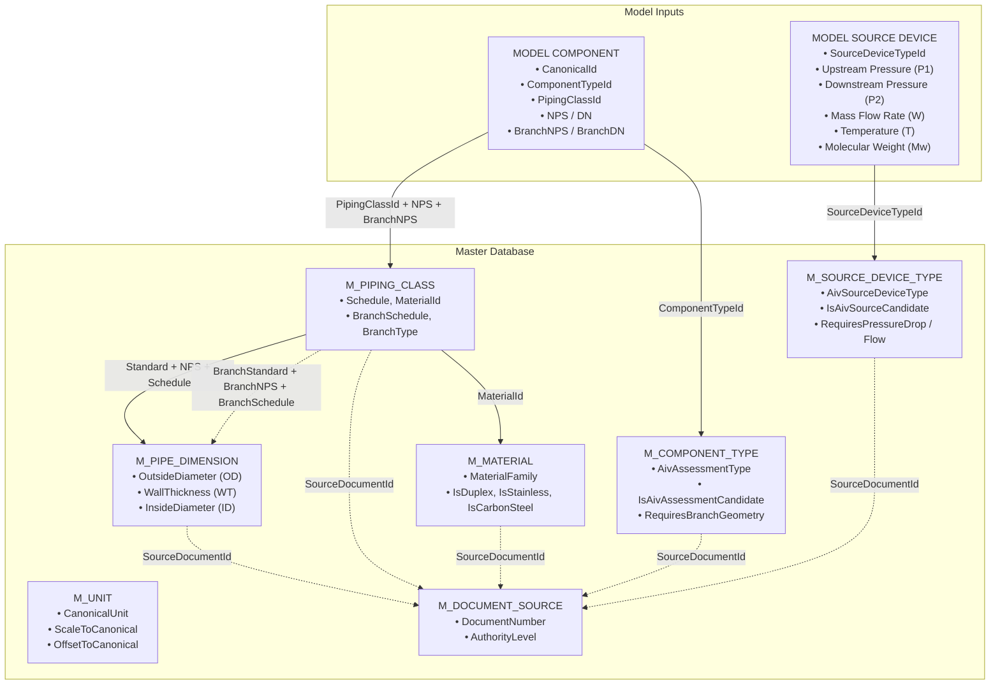

# AIV Master Database Architecture & Phase-1 Specifications

*Directory Location: `F:\CODE-6\Advanced_Analysis\docs\EI data\AIV misc`*

---

## 1. Overview & Objectives

The **Acoustic Induced Vibration (AIV) Master Database** provides a deterministic, controlled, and unit-safe data layer for evaluating high-frequency acoustic fatigue in process pipework (as defined in EI AVIFF Guidelines Module T2.7, NORSOK L-002, and ASME/API standards).

### Key Architectural Invariants
1. **Flat, Controlled CSV Tables**: Every master entity is stored as a portable flat CSV file with stable textual primary keys (`PipeDimensionId`, `MaterialId`, `PipingClassRecordId`, etc.).
2. **No Project-Specific Hardcoding**: Master tables store universal engineering properties and standards (ASME B36.10M, ASTM specifications, standard SI units). Project piping classes reference controlled material and dimensional masters.
3. **Controlled Unit System**: All quantitative data are standardized to canonical SI units via `M_UNIT.csv` with explicit scaling and offsets. Pressure basis (`GAUGE` vs `ABSOLUTE`) is explicitly tracked outside the unit symbol.
4. **Authoritative Provenance**: Every record carries a `SourceDocumentId` linking directly to `M_DOCUMENT_SOURCE.csv` to ensure complete engineering traceability.

---

## 2. Entity-Relationship & Relational Join Chain

The master database enables the deterministic resolution of geometric, material, and operational parameters from 3D model inputs:



---

## 3. Table Schema Specifications

### 3.1 `M_PIPE_DIMENSION.csv`
- **Purpose**: Resolves outer diameter (OD), nominal wall thickness (WT), and inner diameter (ID) from standard, NPS/DN, and Schedule.
- **Primary Key**: `PipeDimensionId` (e.g. `DIM-B3610M-NPS6-SCH40`)
- **Unique Engineering Key**: `Standard + StandardEdition + NPS + Schedule`

| Column | Type | Description / Constraints |
| :--- | :--- | :--- |
| `PipeDimensionId` | String (PK) | Stable textual identifier |
| `Standard` | String | Standard body (e.g. `ASME B36.10M`, `ASME B36.19M`) |
| `StandardEdition` | String | Edition year (e.g. `2022`) |
| `NPS` | String | Nominal Pipe Size in inches (e.g. `1/2`, `2`, `6`, `14`) |
| `DN` | Integer | Diameter Nominal in mm (e.g. `15`, `50`, `150`, `350`) |
| `OutsideDiameter` | Float | Outer diameter value |
| `OutsideDiameterUnit` | String | Unit symbol (e.g. `mm`) |
| `Schedule` | String | Pipe schedule (e.g. `10S`, `40`, `STD`, `80`, `XS`, `160`, `XXS`) |
| `WallThickness` | Float | Nominal wall thickness value |
| `WallThicknessUnit` | String | Unit symbol (e.g. `mm`) |
| `InsideDiameter` | Float | Calculated internal bore ($ID = OD - 2 \cdot WT$) |
| `InsideDiameterUnit` | String | Unit symbol (e.g. `mm`) |
| `SourceDocumentId` | String (FK) | Reference to `M_DOCUMENT_SOURCE` |
| `SourceRecord` | String | Source table/clause |
| `Status` | Enum | `ACTIVE`, `SUPERSEDED`, `DRAFT` |

---

### 3.2 `M_PIPING_CLASS.csv`
- **Purpose**: Resolves pipe schedule, wall thickness, material specification, and branch outlet configurations from project piping material specifications (PMS).
- **Primary Key**: `PipingClassRecordId` (e.g. `PC-A1-PIPE-6`, `PC-A1-WELDOLET-2X6`)

| Column | Type | Description / Constraints |
| :--- | :--- | :--- |
| `PipingClassRecordId` | String (PK) | Unique record identifier |
| `PipingClassId` | String | Piping class code (e.g. `A1`, `B1`, `C1`) |
| `ComponentFamily` | Enum | `PIPE`, `WELDOLET`, `TEE`, `FLANGE`, etc. |
| `NPS` | String | Main run Nominal Pipe Size |
| `DN` | Integer | Main run Diameter Nominal |
| `Schedule` | String | Main run pipe schedule |
| `NominalWallThickness` | Float | Nominal wall thickness (mm) |
| `WallThicknessUnit` | String | Unit symbol (`mm`) |
| `MaterialId` | String (FK) | Reference to `M_MATERIAL` |
| `PressureClass` | String | ASME rating (e.g. `150`, `300`, `600`, `900`) |
| `BranchType` | String | Branch fitting subtype (e.g. `WELDOLET`, `WELDED_TEE`) |
| `BranchNPS` | String | Branch outlet NPS (if applicable) |
| `BranchDN` | Integer | Branch outlet DN (if applicable) |
| `BranchSchedule` | String | Branch pipe schedule |
| `BranchWallThickness` | Float | Branch wall thickness (mm) |
| `Standard` | String | Manufacturing standard (e.g. `ASME B36.10M`, `MSS SP-97`) |
| `SourceDocumentId` | String (FK) | Reference to `M_DOCUMENT_SOURCE` |
| `SourceRecord` | String | Source record / page |
| `Revision` | String | PMS revision number |
| `Status` | Enum | `ACTIVE`, `SUPERSEDED` |

---

### 3.3 `M_MATERIAL.csv`
- **Purpose**: Provides material classifications, material families, and Duplex/Stainless/Carbon Steel flags required for AIV acoustic fatigue limits and S-N curves.
- **Primary Key**: `MaterialId` (e.g. `MAT-A106-B`, `MAT-A790-S31803`)

| Column | Type | Description / Constraints |
| :--- | :--- | :--- |
| `MaterialId` | String (PK) | Stable material identifier |
| `Specification` | String | ASTM / ASME specification (e.g. `ASTM A106`, `ASTM A790`) |
| `Grade` | String | Material grade (e.g. `B`, `UNS S31803`, `TP316L`) |
| `MaterialFamily` | Enum | `CARBON_STEEL`, `LT_CARBON_STEEL`, `AUSTENITIC_STAINLESS_STEEL`, `DUPLEX_STAINLESS_STEEL`, `SUPER_DUPLEX_STAINLESS_STEEL`, `NICKEL_ALLOY`, `TITANIUM` |
| `BaseMaterialType` | String | Standard code (`CS`, `LTCS`, `SS`, `DSS`, `SDSS`, `INCONEL_625`, `TITANIUM_GR2`) |
| `IsDuplex` | Enum | `YES`, `NO` (Directly drives AIV Duplex limit modifier) |
| `IsStainless` | Enum | `YES`, `NO` |
| `IsCarbonSteel` | Enum | `YES`, `NO` |
| `SourceDocumentId` | String (FK) | Reference to `M_DOCUMENT_SOURCE` |
| `SourceRecord` | String | ASTM grade reference |
| `StandardEdition` | String | Standard edition year |
| `Status` | Enum | `ACTIVE`, `OBSOLETE` |

---

### 3.4 `M_COMPONENT_TYPE.csv`
- **Purpose**: Maps 3D model component types into AIV geometric assessment classifications.
- **Primary Key**: `ComponentTypeId` (e.g. `CMP-WELDOLET`, `CMP-BW-TEE`)
- **Allowed `AivAssessmentType`**: `WELDOLET`, `WELDED_TEE`, `WELDED_SUPPORT`, `OTHER_WELDED_DISCONTINUITY`, `NONE`

| Column | Type | Description / Constraints |
| :--- | :--- | :--- |
| `ComponentTypeId` | String (PK) | Component type code |
| `ComponentFamily` | Enum | `BRANCH`, `TEE`, `SUPPORT`, `ATTACHMENT`, `ELBOW`, `REDUCER`, `FLANGE`, `PIPE` |
| `ComponentSubtype` | String | Specific subtype (e.g. `WELDOLET`, `SWEEPOLET`, `TRUNNION_SUPPORT`) |
| `ModelType` | String | 3D CAD/P&ID model mapping symbol |
| `IsAivAssessmentCandidate`| Enum | `YES`, `NO` |
| `AivAssessmentType` | Enum | AIV discontinuity classification |
| `RequiresBranchGeometry` | Enum | `YES`, `NO` |
| `MainSizeRequired` | Enum | `YES`, `NO` |
| `BranchSizeRequired` | Enum | `YES`, `NO` |
| `Description` | String | Engineering description |
| `SourceDocumentId` | String (FK) | Reference to `M_DOCUMENT_SOURCE` |
| `Revision` | String | Rule revision |
| `Status` | Enum | `ACTIVE` |

---

### 3.5 `M_SOURCE_DEVICE_TYPE.csv`
- **Purpose**: Maps equipment and valve model types into AIV acoustic sound power source classes.
- **Primary Key**: `SourceDeviceTypeId` (e.g. `SRC-PSV`, `SRC-PCV`, `SRC-RO-SINGLE`)
- **Allowed `AivSourceDeviceType`**: `CONTROL_VALVE`, `RELIEF_VALVE`, `RESTRICTION_ORIFICE`, `PRESSURE_REDUCING_BRANCH_CONNECTION`, `NONE`

| Column | Type | Description / Constraints |
| :--- | :--- | :--- |
| `SourceDeviceTypeId` | String (PK) | Source device identifier |
| `ComponentFamily` | Enum | `VALVE`, `ORIFICE`, `BRANCH` |
| `ComponentSubtype` | String | Subtype (e.g. `PSV`, `BDV`, `PCV`, `MULTI_HOLE_ORIFICE`) |
| `ModelType` | String | 3D model / instrument type |
| `IsAivSourceCandidate` | Enum | `YES`, `NO` |
| `AivSourceDeviceType` | Enum | AIV source calculation model |
| `RequiresPressureDrop` | Enum | `YES`, `NO` |
| `RequiresMassFlow` | Enum | `YES`, `NO` |
| `RequiresTemperature` | Enum | `YES`, `NO` |
| `RequiresMolecularWeight`| Enum | `YES`, `NO` |
| `SupportsLowNoiseTrim` | Enum | `YES`, `NO` |
| `Description` | String | Device description |
| `SourceDocumentId` | String (FK) | Reference to `M_DOCUMENT_SOURCE` |
| `Revision` | String | Rule revision |
| `Status` | Enum | `ACTIVE` |

---

### 3.6 `M_UNIT.csv`
- **Purpose**: Canonical engineering unit and conversion authority.
- **Primary Key**: `UnitId` (e.g. `U-LEN-MM`, `U-PRESS-BAR`, `U-TEMP-C`)

$$\text{Value}_{\text{canonical}} = (\text{Value}_{\text{input}} \times \text{ScaleToCanonical}) + \text{OffsetToCanonical}$$

| Column | Type | Description |
| :--- | :--- | :--- |
| `UnitId` | String (PK) | Unique unit code |
| `QuantityType` | Enum | `LENGTH`, `PRESSURE`, `TEMPERATURE`, `MASS_FLOW`, `DENSITY`, `VELOCITY`, `DYNAMIC_VISCOSITY`, `MOLECULAR_WEIGHT`, `FREQUENCY`, `ACOUSTIC_LEVEL`, `POWER`, `DIMENSIONLESS` |
| `UnitSymbol` | String | Display symbol (e.g. `mm`, `bar`, `degC`, `kg/s`) |
| `CanonicalUnit` | String | Canonical SI unit (`m`, `Pa`, `K`, `kg/s`, `dB`, `W`, etc.) |
| `ScaleToCanonical` | Float | Multiplier factor |
| `OffsetToCanonical` | Float | Additive offset (e.g. 273.15 for $^\circ\text{C} \to \text{K}$) |
| `PressureBasisAllowed` | Enum | `YES` (for pressure units where gauge/absolute must be defined), empty otherwise |
| `Description` | String | Unit name |
| `Status` | Enum | `ACTIVE` |

---

### 3.7 `M_DOCUMENT_SOURCE.csv`
- **Purpose**: Common provenance and standard authority registry.
- **Primary Key**: `SourceDocumentId` (e.g. `DOC-ASME-B3610`, `DOC-EI-AVIFF-2008`, `DOC-PMS-A1`)

| Column | Type | Description |
| :--- | :--- | :--- |
| `SourceDocumentId` | String (PK) | Unique document code |
| `DocumentNumber` | String | Standard / PMS number |
| `DocumentTitle` | String | Full formal title |
| `DocumentType` | Enum | `STANDARD`, `INDUSTRY_GUIDELINE`, `PMS`, `ENGINEERING_RULE` |
| `Organization` | String | Issuing organization (ASME, ASTM, MSS, Energy Institute, Project) |
| `Edition` | String | Edition identifier |
| `Revision` | String | Revision number |
| `IssueDate` | Date | Date of issue |
| `AuthorityLevel` | Enum | `AUTHORITATIVE`, `PROJECT_AUTHORITY`, `CONTROLLED_ENGINEERING` |
| `RecordVersion` | String | Record version |
| `FileReference` | String | Master PDF file name |
| `DocumentHash` | String | SHA-256 hash (optional) |
| `SupersededBy` | String | Pointer to superseding doc ID |
| `DataOwner` | String | Custodian discipline |
| `Status` | Enum | `ACTIVE`, `SUPERSEDED` |

---

## 4. Example Query / Join Recipes

### 4.1 Resolving AIV Discontinuity Geometry (Python / Pandas)

```python
import pandas as pd

# Load master tables
m_comp = pd.read_csv("masters/M_COMPONENT_TYPE.csv")
m_pclass = pd.read_csv("masters/M_PIPING_CLASS.csv")
m_pdim = pd.read_csv("masters/M_PIPE_DIMENSION.csv")
m_mat = pd.read_csv("masters/M_MATERIAL.csv")

# Input Model Component
input_comp = {
    "ComponentTypeId": "CMP-WELDOLET",
    "PipingClassId": "A1",
    "NPS": "6",
    "BranchNPS": "2"
}

# 1. Resolve Assessment Type
comp_info = m_comp[m_comp["ComponentTypeId"] == input_comp["ComponentTypeId"]].iloc[0]
aiv_type = comp_info["AivAssessmentType"]  # -> 'WELDOLET'

# 2. Resolve Piping Class Record
pclass_rec = m_pclass[
    (m_pclass["PipingClassId"] == input_comp["PipingClassId"]) &
    (m_pclass["NPS"] == input_comp["NPS"]) &
    (m_pclass["BranchNPS"] == input_comp["BranchNPS"])
].iloc[0]

# 3. Resolve Header Dimensions
main_dim = m_pdim[
    (m_pdim["NPS"] == input_comp["NPS"]) &
    (m_pdim["Schedule"] == pclass_rec["Schedule"])
].iloc[0]
header_od = main_dim["OutsideDiameter"]       # -> 168.3 mm
header_wt = main_dim["WallThickness"]         # -> 7.11 mm

# 4. Resolve Material & Duplex State
mat_rec = m_mat[m_mat["MaterialId"] == pclass_rec["MaterialId"]].iloc[0]
is_duplex = (mat_rec["IsDuplex"] == "YES")    # -> False (Carbon Steel)
```

---

## 5. Validation and Test Execution

Run the automated test suite anytime master records are modified:

```powershell
python "F:\CODE-6\Advanced_Analysis\docs\EI data\AIV misc\validate_aiv_masters.py"
```

The script verifies:
1. All 7 CSV files exist and have non-null, unique Primary Keys.
2. Every `SourceDocumentId` resolves in `M_DOCUMENT_SOURCE`.
3. Every `MaterialId` in `M_PIPING_CLASS` resolves in `M_MATERIAL`.
4. Header and branch pipe dimensions resolve in `M_PIPE_DIMENSION`.
5. All domain enums and Boolean flags conform to strict allowed value sets.
6. Deterministic join chains execute end-to-end without errors.
