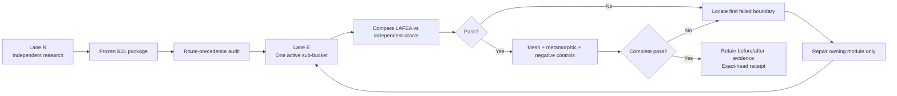

# LAFEA B01 Qualification Benchmark Research Package

## Executive summary

The selected qualification bucket is **B01 — LAFEA.3 continuum affine/formulation foundation**, because the research specification explicitly requires B01 when no `TARGET_BUCKET` is supplied. The governing objective is not merely to demonstrate plausible finite-element answers, but to create independent, frozen evidence capable of driving the sequence “run → compare with oracle → isolate first failed boundary → repair owning module only → rerun unchanged evidence.” fileciteturn0file0

The resulting deliverable is a **machine-readable, executable Lane R benchmark package** containing six primary affine-continuum cases, candidate T3/Q4/T6/Q8 discretizations, three explicit refinement levels per family, fixed physical probes, independent closed-form oracle calculations, exact expected values, metamorphic transformations, negative controls, acceptance profiles, source dossiers, ownership mappings, failure signatures, run order, and SHA-256 evidence. The ZIP contains **70 files, including 54 validated JSON files**; its integrity test found no bad ZIP member. The archive SHA-256 is:

`f1e99f15dece59536ea8f879f69b743d1a8f16b7ceb4cb49d74c697d64c98f01`

[Download the complete B01 benchmark data package](sandbox:/mnt/data/lafea-benchmark-data-B01.zip)

The external methodology is deliberately conservative. ASME currently lists **V&V 10-2019 (R2025)** as its standard for verification and validation in computational solid mechanics; ASME describes it as providing a common framework and guidance for computational-solid-mechanics VVUQ. citeturn13search6turn1search11 NAFEMS P01 specifically identifies membrane completeness tests, assemblage patch tests, false zero-energy-mode tests, invariance tests, and shape-sensitivity tests as basic element tests—almost exactly the dimensions needed by B01—although NAFEMS now labels P01 an archived historical publication rather than current best practice. citeturn12search1turn12search0 Taylor, Simo, Zienkiewicz, and Chan’s classic 1986 paper establishes the patch test as a central FEM consistency/convergence diagnostic rather than merely an example problem. citeturn1search2

The package therefore treats an affine displacement field as an **exact code-verification problem**, not as a convergence-to-an-approximate-answer problem. Bathe’s MIT finite-element notes explicitly use the same isoparametric interpolation functions for coordinates and displacements and derive the required Jacobian transformation; this is the mathematical reason a compatible complete isoparametric element can reproduce an affine field exactly up to numerical arithmetic and solver error. citeturn8view0turn9view1 This is also consistent with the broader verification principle articulated by Sandia: verification accuracy should be assessed against analytical or otherwise highly accurate independent solutions, with software testing forming part of the verification activity. citeturn13search0turn13search16

The principal unresolved item is **current LAFEA route binding**. No repository snapshot was supplied with the research request, and the connected GitHub installation exposed no repository named LAFEA. Consequently, the package does **not** invent stage-registry routes, public APIs, source paths, or current element-family claims. Every case is conservatively marked `RESEARCH_ONLY_UNIMPLEMENTED` with `productionAuthorityGrantedByBenchmark=false`. In this package that classification means **“research artifact whose registered production route has not been proven in this research session,” not “proof that LAFEA lacks this capability.”** Lane E must first audit the required source-of-truth precedence before upgrading any case to `REGISTERED_APPLICATION_ROUTE` or `PUBLIC_KERNEL_ROUTE`. This avoids precisely the false-qualification failure prohibited by the research specification. fileciteturn0file0

## Scope, assumptions, and methodological basis

### Scope chosen for B01

B01 is interpreted as the lowest-level **two-dimensional small-strain linear-continuum formulation foundation**: before engineering loading, stress-concentration, thin-shell, trunnion, analytical-mechanics, or governance buckets can be trusted, LAFEA.3 should correctly reproduce affine kinematics, constitutive coupling, isoparametric coordinate behavior, rigid-body null strain, energy, frame covariance, and basic mesh validity. This ordering follows the user-specified production sequence and does not pull easier B02–B06 cases forward. fileciteturn0file0

This scope is strongly aligned with NAFEMS’ historical element-quality taxonomy. P01 enumerates membrane completeness, assemblage patch, false zero-energy, invariance, and shape-sensitivity tests; NAFEMS’ current glossary likewise lists those categories under “element performance and shape sensitivity.” citeturn12search1turn12search0 NAFEMS’ broader standard-benchmark program was deliberately created as an independent set of tests for assessing finite-element systems, with analytical targets preferred wherever practical. citeturn2search7

MacNeal and Harder’s 1985 paper provides complementary benchmark-design authority: their proposed test set combined patch, beam, plate, and shell problems specifically to expose parameters affecting finite-element accuracy and subsequently became a de facto comparison set for element formulations. B01 uses the *philosophy* of independent, discriminating formulation tests, but does not use a MacNeal–Harder numerical target because an affine continuum admits a stronger exact closed-form oracle. citeturn1search4

### Research assumptions

| Item | Frozen assumption for this package | Consequence |
|---|---|---|
| Target bucket | `B01` | Default required by the supplied research specification. fileciteturn0file0 |
| Stage | `LAFEA.3` | Qualification target is continuum affine/formulation foundation. |
| Analysis | 2D, linear static, small strain | Rigid rotation is interpreted infinitesimally; nonlinear geometric strain is outside this bucket. |
| Materials | Homogeneous isotropic linear elasticity | Allows independent plane-stress/plane-strain Hooke-law oracle. |
| Base units | mm, N, MPa, N·mm | Unit-scaled metamorphic cases independently test canonicalization. |
| Shear convention | Engineering shear `γxy = ∂u/∂y + ∂v/∂x` | Prevents the common factor-of-two tensor/engineering-shear ambiguity. |
| Boundary condition | Exact affine displacement prescribed on all exterior nodes; interior nodes free | The FE system must recover the affine interior rather than having every DOF prescribed. |
| Candidate elements | T3, Q4, T6, Q8 | Research matrix only; actual production element families must be route-bound from repository evidence. |
| Mesh ladder | M0/M1/M2 with deterministic distortion | Exact patch behavior is required at every level; no moving probe or moving maximum. |
| Production authority | False until route audit | Component or research success cannot silently qualify the application route. |

Bathe’s MIT notes explicitly describe two-dimensional plane-stress/plane-strain elements, isoparametric coordinate interpolation, corresponding displacement interpolation, Jacobian transformations, and the strain-displacement machinery used by these continuum elements. citeturn5view1turn8view0 The University of Alberta’s engineering mechanics text independently presents the plane-stress linear-elastic constitutive relationship, including its reduced stress/strain relationship. citeturn3search21

The resulting oracle is conceptually a simple **method of exact/manufactured solution**: choose a field whose derivatives and material response are known independently, impose compatible boundary conditions, and ask whether the code recovers it. FDA’s contemporary solid-mechanics MMS guidance explicitly identifies code verification as the first credibility step and points to ASME V&V 10 Section 5.1.1.2 for numerical code verification. citeturn13search8 Sandia likewise distinguishes code verification from calculation/solution verification and emphasizes comparison against accurate analytical solutions. citeturn13search0turn13search1



## Benchmark family and independent expected results

### Governing equations

Every primary case uses

\[
u(x,y)=u_0+u_xx+u_yy,\qquad
v(x,y)=v_0+v_xx+v_yy
\]

with the coefficients named literally in the machine-readable input. The exact small-strain state is therefore

\[
\epsilon_{xx}=u_x,\qquad
\epsilon_{yy}=v_y,\qquad
\gamma_{xy}=u_y+v_x.
\]

Bathe’s MIT study guide shows the common isoparametric coordinate interpolation and displacement interpolation and derives physical shape-function gradients via the Jacobian transformation. citeturn8view0 The package differentiates the affine field analytically rather than borrowing any strain value from LAFEA.

For plane stress, the independent oracle evaluates

\[
\begin{bmatrix}
\sigma_{xx}\\
\sigma_{yy}\\
\tau_{xy}
\end{bmatrix}
=
\frac{E}{1-\nu^2}
\begin{bmatrix}
1&\nu&0\\
\nu&1&0\\
0&0&(1-\nu)/2
\end{bmatrix}
\begin{bmatrix}
\epsilon_{xx}\\
\epsilon_{yy}\\
\gamma_{xy}
\end{bmatrix},
\]

consistent with the standard plane-stress linear-elastic relation documented by the University of Alberta. citeturn3search21

For plane strain, the oracle evaluates

\[
\begin{bmatrix}
\sigma_{xx}\\
\sigma_{yy}\\
\tau_{xy}
\end{bmatrix}
=
\frac{E}{(1+\nu)(1-2\nu)}
\begin{bmatrix}
1-\nu&\nu&0\\
\nu&1-\nu&0\\
0&0&(1-2\nu)/2
\end{bmatrix}
\begin{bmatrix}
\epsilon_{xx}\\
\epsilon_{yy}\\
\gamma_{xy}
\end{bmatrix},
\]

which is the isotropic two-dimensional constitutive form represented in Bathe’s Topic 7 material. citeturn9view1

The exact internal strain energy is

\[
U=\frac12\left(
\epsilon_{xx}\sigma_{xx}+
\epsilon_{yy}\sigma_{yy}+
\gamma_{xy}\tau_{xy}
\right)WHt.
\]

Because stress is constant and body force is zero, the closed-boundary resultant is zero, providing an additional equilibrium check independent of individual mesh-dependent nodal reaction partitioning.

### Primary physical cases

| Benchmark | Exact affine strain `[εxx, εyy, γxy]` | Material / geometry | Exact stress `[σxx, σyy, τxy]` MPa | Exact strain energy |
|---|---:|---|---:|---:|
| `LAFEA3-AFFINE-PS-01` | `[0.0004, -0.00015, 0.00025]` | Plane stress; E=210000 MPa, ν=0.3; 200×100×8 mm | `[81.9230769231, -6.92307692308, 20.1923076923]` | `3108.46153846 N·mm` |
| `LAFEA3-AFFINE-PE-02` | `[-0.0002, 0.0003, -0.00012]` | Plane strain; E=70000 MPa, ν=0.28; 120×80×5 mm | `[-7.45738636364, 19.8863636364, -3.28125]` | `188.427272727 N·mm` |
| `LAFEA3-AFFINE-SHEAR-03` | `[0, 0, 0.0012]` | Plane stress; E=80000 MPa, ν=0.25; 150×90×3 mm | `[0, 0, 38.4]` | `933.12 N·mm` |
| `LAFEA3-AFFINE-RIGID-04` | `[0, 0, 0]` | Plane stress; E=210000 MPa, ν=0.3; 100×70×6 mm | `[0, 0, 0]` | `0` |
| `LAFEA3-AFFINE-UNIAX-05` | `[0.001, -0.0003, 0]` | Plane stress; E=200000 MPa, ν=0.3; 100×50×4 mm | `[200, 0, 0]` | `2000 N·mm` |
| `LAFEA3-AFFINE-BIAX-06` | `[0.0005, 0.0005, 0]` | Plane stress; E=210000 MPa, ν=0.3; 160×110×2.5 mm | `[150, 150, 0]` | `3300 N·mm` |

These numerical targets were calculated independently from the cited small-strain and isotropic-elastic equations using 50-digit `decimal.Decimal` arithmetic; they are not published reference numbers and were not calibrated against LAFEA. That distinction is important under the requested oracle hierarchy: the classification is `INDEPENDENT_CLOSED_FORM`, not `CROSS_SOLVER_REFERENCE`. The supporting literature establishes the governing equations and verification methodology, while the package retains the actual substitutions and intermediates. citeturn8view0turn3search21turn13search0

The general plane-stress case deliberately has **all six affine coefficients nonzero**, including unequal cross-derivative terms. That makes it considerably harder for a transposed coordinate mapping, incorrect engineering-shear convention, sign error, or accidental symmetric special case to pass. The pure-shear case isolates the shear modulus and engineering-shear convention; the uniaxial case produces exactly `σxx = E εxx`, `σyy=0`; the equibiaxial case isolates Poisson coupling; and the rigid case isolates the symmetric-gradient null space.

### Quantity identity and fixed probes

Each case freezes four physical probes:

`P1=(0.25W,0.25H)`, `P2=(0.50W,0.50H)`, `P3=(0.75W,0.40H)`, and `P4=(0.30W,0.80H)`.

At every probe, the package stores separate quantity records for `UX`, `UY`, `EPSILON_XX`, `EPSILON_YY`, `GAMMA_XY`, `SIGMA_XX`, `SIGMA_YY`, and `TAU_XY`, plus global strain energy and reaction resultants. Each record explicitly freezes the physical quantity, frame, physical coordinate, surface, recovery method, representation, units, source equation, decimal derivation trace, and tolerance. That enforces the user’s required identity

\[
Q=(q,\mathrm{frame},x,\mathrm{surface},\mathrm{recovery},\mathrm{representation},\mathrm{units})
\]

rather than treating two similarly named stress outputs as interchangeable. fileciteturn0file0

Raw/fixed-coordinate tensor stress is therefore not interchangeable with extrapolated nodal stress, nodal averaging, smoothed display stress, screen interpolation, or a moving mesh maximum. NAFEMS’ standard-benchmark philosophy also emphasizes clearly defined target quantities rather than generic visual agreement. citeturn2search7

## Meshes, metamorphic tests, and acceptance

### Frozen mesh ladders

The package contains explicit node coordinates and connectivity for all of the following:

| Family | M0 | M1 | M2 | Quadratic-node policy |
|---|---:|---:|---:|---|
| T3 | 8 elements | 32 | 128 | — |
| Q4 | 4 elements | 16 | 64 | — |
| T6 | 8 elements | 32 | 128 | Every midside node is the exact physical midpoint of its parent edge |
| Q8 | 4 elements | 16 | 64 | Every midside node is the exact physical midpoint of its parent edge |

Each ladder starts from a unit-square template, is scaled exactly to the case width and height, fixes the exterior boundary, and applies a bounded deterministic perturbation only to interior nodes. The triangular splitting alternates across logical cells rather than creating a perfectly symmetric “lucky” mesh. This design follows the intent of NAFEMS’ shape-sensitivity and invariance testing while preserving an exact affine continuum solution. citeturn12search0turn12search4

The same affine target must pass **independently at M0, M1, and M2**. No formal Richardson extrapolation or GCI is computed for these cases. That is deliberate: Taylor et al. describe the patch test as a consistency/convergence diagnostic, but an affine completeness test does not provide a useful nonzero asymptotic discretization-error sequence when the formulation is correct. citeturn1search2 Forcing a GCI number out of roundoff-level patch errors would violate the user’s instruction to use Richardson/GCI only when a systematic asymptotic sequence supports it. fileciteturn0file0

The package nevertheless prepares `convergence-expectations.json` so that a later non-affine B02 problem can use M0–M3 or finer meshes and formal observed-order/GCI criteria without changing the B01 benchmark semantics.

### Metamorphic variants

Every primary case contains the following transformations where mechanically meaningful:

| Variant | Frozen transformation | Required relationship |
|---|---|---|
| `TRANSLATED` | Geometry shifted by `[137.25,-84.5] mm` | Strain, stress, and energy invariant |
| `ROTATED_37_DEG` | Entire problem rotated 37° about domain centroid | Tensor/vector components transform covariantly; invariants and energy unchanged |
| `LOAD_SCALED_2P5` | Prescribed affine field ×2.5 | displacement/strain/stress ×2.5; energy ×6.25 |
| `LOAD_REVERSED` | Prescribed affine field ×−1 | displacement/strain/stress reverse sign; energy unchanged |
| `UNIT_SCALED_MM_TO_M` | Exact physical problem expressed in m/N/Pa | Canonical physical answer unchanged after unit conversion |

The rotation case is particularly diagnostic. A base case that passes while the 37° case fails should move investigation toward coordinate transformation, Jacobian/orientation handling, tensor transformation, or recovery rather than immediately toward the global solver. Bathe’s treatment explicitly places coordinate interpolation and Jacobian transformation at the center of two-dimensional isoparametric element evaluation. citeturn5view1turn8view0

### Pre-execution acceptance

The repository-specific thresholds were frozen **before any LAFEA execution**:

| Quantity class | Absolute tolerance | Relative tolerance |
|---|---:|---:|
| Nonzero displacement | `1e-10 mm` | `5e-9` |
| Zero displacement | `1e-10 mm` | `0` |
| Strain | `1e-12` | `2e-9` |
| Nonzero stress | `1e-8 MPa` | `2e-9` |
| Zero stress | `1e-8 MPa` | `0` |
| Strain energy | `1e-8 N·mm` | `5e-9` |
| Net reaction | `1e-6 N` | `0` |
| Free-DOF normalized infinity residual | — | `≤1e-10` |

These are **not represented as published NAFEMS or ASME tolerances**. They are proposed repository numerical acceptances for exact-patch problems. That distinction is retained explicitly in every case’s `acceptance-profile.json`. The zero-reference quantities use absolute rather than percentage-only acceptance, as required by the research specification. fileciteturn0file0

## Negative controls and engineering-boundary diagnosis

### Fail-closed controls

Each primary benchmark has at least one directly associated negative control:

| Primary case | Negative mutation | First expected rejection layer |
|---|---|---|
| General plane stress | Non-finite Young’s modulus | `SOURCE_CONTRACT` |
| General plane strain | `ν=0.5` | `CONSTITUTIVE` |
| Pure shear | Negative thickness | `SOURCE_CONTRACT` |
| Rigid motion | Reverse one element’s connectivity / invalid Jacobian | `MESH_QUALITY` |
| Uniaxial | Duplicate node identity | `TOPOLOGY` |
| Equibiaxial | Unregistered formulation identifier | `WORKFLOW` |

The bucket-wide governance data also includes invalid/conflicting units, a disconnected mesh island, coincident-but-independent internal interface nodes, an intentionally displaced quadratic midside node, and a deliberately under-restrained rigid-body mechanism. All are classified `NEGATIVE_GOVERNANCE_EXPECTATION`; the required authority state is `REJECTED_NONAUTHORITATIVE`, and the listed authoritative downstream artifacts must not exist.

The mathematical basis for enforcing a valid coordinate map is particularly strong: isoparametric physical derivatives require inversion of the element Jacobian, as shown explicitly in Bathe’s finite-element derivation. citeturn8view0 NAFEMS’ element-performance materials separately identify shape sensitivity and element-quality behavior as basic verification dimensions. citeturn12search0turn12search14

### Failure-signature matrix

The most important engineering use of B01 is **not “red/green test status”; it is boundary localization**.

| Observed evidence | Investigate first | Do not initially change |
|---|---|---|
| Exact prescribed boundary values are already wrong | `SOURCE_CONTRACT`, `CANONICALIZATION`, `UNITS` | element formulation or solver |
| Boundary values right; local element affine patch wrong | `ELEMENT_FORMULATION`, `GEOMETRY` | recovery or convergence |
| Local element passes; free-DOF assembled residual wrong | `GLOBAL_ASSEMBLY` | constitutive relation |
| Assembled equations correct; solved residual wrong | `LINEAR_SOLVER` | mesher |
| Nodal displacement correct; strain wrong | `ELEMENT_FORMULATION` / B-matrix / Jacobian | linear solver |
| Strain correct; stress wrong | `CONSTITUTIVE`, `UNITS`, then `RECOVERY` | global assembly |
| Raw stress correct; averaged/display value wrong | `RECOVERY`, `AVERAGING_PROJECTION`, `RESULT_CONTRACT` | formulation |
| Point quantities correct; total energy wrong | element integration / energy reconstruction | load scaling |
| Base passes; translation fails | `GEOMETRY`, `CANONICALIZATION`, probe custody | constitutive law |
| Base passes; rotation fails | frame/Jacobian/tensor transform | solver tolerance |
| Unit-scaled case fails only after canonical comparison | `UNITS`, `RESULT_CONTRACT` | finite-element polynomial order |
| T3 passes; distorted Q4 fails | Q4 Jacobian/interpolation/quadrature | global solver |
| First-order families pass; T6/Q8 fail | quadratic interpolation / midside policy | continuum constitutive law |
| Mesh level changes the “same” probe location | `FIXED_PROBE_RECOVERY` | solver |
| Negative Jacobian produces authoritative output | `MESH_QUALITY`, `AUTHORITY_STATE` | numerical tolerance |
| Disconnected component is accepted | `TOPOLOGY`, then `AUTHORITY_STATE` | constitutive model |
| Warning appears but release-quality output is emitted | `AUTHORITY_STATE`, `WORKFLOW`, `AUDIT_PROVENANCE` | physics |

This boundary-first philosophy is consistent with verification literature that distinguishes software/code defects from discretization and calculation error rather than conflating them. citeturn13search0turn13search4

The repair loop embedded in the package consequently forbids a common anti-pattern: changing mesh generation, formulation, solver settings, and recovery simultaneously until a benchmark happens to pass. The user’s requested “minimum governed fix, then identical rerun” rule is preserved verbatim in the execution artifacts. fileciteturn0file0

## Execution-route status and delivered package

### Production route binding

The specification gives a strict source-of-truth precedence:

`registered stage definition → registered application execution route → public kernel API/contracts → current source implementation → current executable checks → current architecture documentation → historical/design documentation`. fileciteturn0file0

That audit could not be completed from public web research because “LAFEA” is not identifiable on the public web as the software described here, and the connected GitHub account exposed no repository matching it. A public-web search for the term primarily returned unrelated uses of “LaFEA,” so inventing repository ownership or application routes would be materially less reliable than leaving route binding unresolved. This is why the package separates **independent physical authority** from **implementation authority**.

Accordingly:

- `registeredRoute` is `null`;
- `routeBindingStatus` is `BLOCKED_NO_REPOSITORY_SNAPSHOT`;
- every current `executionBoundary` is `RESEARCH_ONLY_UNIMPLEMENTED`;
- T3/Q4/T6/Q8 are labelled a `CANDIDATE_RESEARCH_MATRIX_ROUTE_BINDING_REQUIRED`;
- `productionAuthorityGrantedByBenchmark=false`.

This is a deliberate safeguard against representing a formulation component or research oracle as production application qualification. It must be replaced with exact stage/route data after the repository-precedence audit, but the closed-form expected values, physical models, mesh definitions, probes, variants, and acceptances do **not** need to change when that binding occurs.

### Artifact tree delivered

The ZIP provides the requested structure plus a package checksum manifest:

```text
validation/lafea-benchmark-data/B01/
├── README.md
├── bucket-manifest.json
├── claim-matrix.csv
├── execution-route-matrix.csv
├── repair-ownership-map.csv
├── benchmark-index.csv
├── package-checksums.json
├── sources/
│   ├── source-dossier.md
│   └── source-registry.json
├── oracle/
│   ├── oracle-methodology.md
│   ├── independent-oracle.py
│   ├── expected-values.json
│   ├── expected-values-regenerated.json
│   └── oracle-trace.json
├── cases/
│   ├── LAFEA3-AFFINE-PS-01/
│   ├── LAFEA3-AFFINE-PE-02/
│   ├── LAFEA3-AFFINE-SHEAR-03/
│   ├── LAFEA3-AFFINE-RIGID-04/
│   ├── LAFEA3-AFFINE-UNIAX-05/
│   └── LAFEA3-AFFINE-BIAX-06/
│       ├── benchmark-manifest.json
│       ├── model-input.json
│       ├── expected-results.json
│       ├── quantity-definitions.json
│       ├── acceptance-profile.json
│       ├── negative-case.json
│       ├── metamorphic-variants.json
│       └── derivation.md
├── convergence/
│   ├── mesh-ladders.json
│   ├── fixed-probes.json
│   └── convergence-expectations.json
├── governance/
│   ├── negative-cases.json
│   └── expected-fail-closed-behavior.json
└── execution/
    ├── run-order.json
    ├── failure-classification.md
    └── repair-loop.md
```

`independent-oracle.py` imports no LAFEA code and uses Python standard-library `Decimal` arithmetic only. It regenerates a second independent trace file, while `oracle-trace.json` records the Python version, precision, SHA-256 of the oracle source, SHA-256 of the expected-value output, and explicit independence assertions. This follows the requested requirement that the oracle remain independent from `src/`, retain intermediates, and be hashable/reproducible. fileciteturn0file0

The complete deliverable is available here:

**[Download `lafea-benchmark-data-B01.zip`](sandbox:/mnt/data/lafea-benchmark-data-B01.zip)**

## Source dossier and research priorities

The highest-priority sources used for B01 are:

| Priority | Authority | Role in this package |
|---|---|---|
| Primary standard | **ASME V&V 10-2019 (R2025)** | Overall computational-solid-mechanics verification framework. ASME currently identifies this reaffirmed edition on its standards catalog. citeturn13search6 |
| Independent verification body | **NAFEMS P01, Robinson, 1985** | Direct taxonomy for completeness, patch, zero-energy, invariance, and shape-sensitivity tests; retained as historical benchmark authority, with NAFEMS explicitly noting its archived status. citeturn12search1 |
| Original peer-reviewed paper | **Taylor, Simo, Zienkiewicz & Chan, 1986**, IJNME 22, 39–62, DOI `10.1002/nme.1620220105` | Theoretical basis for interpreting the patch test as a FEM consistency/convergence condition. citeturn1search2 |
| Academic formulation source | **K.-J. Bathe, MIT OCW RES.2-002, Lecture 7, 2010** | Isoparametric coordinate/displacement interpolation, Jacobian transformation, two-dimensional continuum formulation and constitutive machinery. citeturn6search0turn8view0 |
| Academic elasticity source | **University of Alberta, Linear Elastic Materials** | Independent plane-stress Hooke-law equation used by the oracle. citeturn3search21 |
| U.S. national-lab verification report | **Oberkampf & Trucano, SAND2002-0529**, DOI `10.2172/793406` | Independent analytical/high-accuracy reference solutions and code-vs-solution verification distinction. citeturn13search0turn13search16 |
| Original benchmark-design paper | **MacNeal & Harder, 1985**, FEAD 1, 3–20, DOI `10.1016/0168-874X(85)90003-4` | Benchmark-family design philosophy and standardized accuracy tests; contextual rather than numerical oracle for B01. citeturn1search4 |
| Broader NAFEMS program | **The Standard NAFEMS Benchmarks, P18** | Confirms NAFEMS’ independent-code-assessment philosophy and preference for analytical targets where available. citeturn2search7 |

NAFEMS R0006 is also relevant to the future qualification program because it documents the background to standard benchmarks such as the elliptic membrane, shell patch, skew plate, and other structural tests; those are better suited to B02/B03 than to the exact affine B01 foundation. citeturn2search0 NAFEMS P18’s LE1 elliptic membrane, for example, has a published target tangential stress of 92.7 MPa and has been independently exercised by major FEA systems; it is an excellent later continuum stress-gradient/convergence case, but it is deliberately excluded from B01 because it confounds formulation completeness with discretization and recovery error. citeturn12search8turn2search11

The resulting research programme therefore preserves the intended sequence: **B01 proves the affine/formulation floor first; B02 can then introduce load assembly, nonuniform engineering response, recovery, and actual convergence; later buckets can safely add shells, load introduction, analytical mechanics, and governance.** That ordering is both mechanically defensible and faithful to the frozen qualification sequence in the supplied specification. fileciteturn0file0