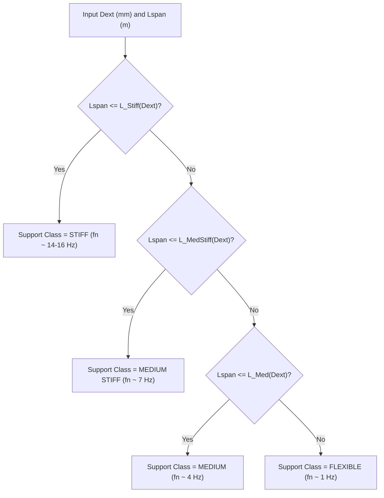
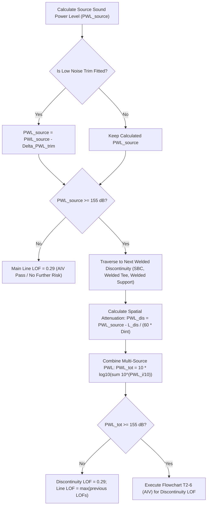

# Energy Institute (EI) AVIFF 2nd Edition — Complete Master Engineering Data Register

*Primary Reference: Energy Institute — Guidelines for the Avoidance of Vibration Induced Fatigue Failure in Process Pipework (2nd Edition, 2008).*

---

# Table of Contents
1. [Executive Summary & Source Numbering Reconciliation](#1-executive-summary--source-numbering-reconciliation)
2. [P0 — Flow Induced Turbulence (FIT) Master Data (Module T2.2)](#2-p0--flow-induced-turbulence-fit-master-data-module-t22)
   - [2.1 Table T2-1: Support Arrangement & Span Classification](#21-table-t2-1--support-arrangement--span-classification)
   - [2.2 Table T2-2: Method of Calculating Flow Induced Vibration Factor $F_v$](#22-table-t2-2--method-of-calculating-flow-induced-vibration-factor-fv)
   - [2.3 Flowchart T2-1: FIT Assessment Workflow](#23-flowchart-t2-1--fit-assessment-workflow)
   - [2.4 Fluid Viscosity Factor (FVF) & Valve Trim Kinetic Energy Limits](#24-fluid-viscosity-factor-fvf--valve-trim-kinetic-energy-limits)
3. [P0 — High Frequency Acoustic Excitation (AIV) Master Data (Module T2.7)](#3-p0--high-frequency-acoustic-excitation-aiv-master-data-module-t27)
   - [3.1 Flowchart T2-5: Acoustic Fatigue Source PWL & Screening](#31-flowchart-t2-5--acoustic-fatigue-source-pwl--screening)
   - [3.2 Flowchart T2-6 (AIV): Welded Discontinuity LOF Assessment](#32-flowchart-t2-6-aiv--welded-discontinuity-lof-assessment)
   - [3.3 AIV Discontinuity Modifiers ($FLM_1, FLM_2, FLM_3$)](#33-aiv-discontinuity-modifiers-flm_1-flm_2-flm_3)
4. [P0 — Small Bore Connection (SBC) Master Data (Module T3)](#4-p0--small-bore-connection-sbc-master-data-module-t3)
   - [4.1 Table T3-1: Fitting Span Factors](#41-table-t3-1--fitting-span-factors)
   - [4.2 Table T3-2: Minimum First Span Limits (Deck/Steelwork)](#42-table-t3-2--minimum-first-span-limits-decksteelwork)
   - [4.3 Table T3-3: Minimum Span Limits (Between Main Lines)](#43-table-t3-3--minimum-span-limits-between-main-lines)
   - [4.4 Digitized Figures T3-1 to T3-4 (SBC Maximum Span Curves)](#44-digitized-figures-t3-1-to-t3-4-sbc-maximum-span-curves)
   - [4.5 SBC Assessment Types & Synthesis](#45-sbc-assessment-types--synthesis)
5. [P1 — Qualitative Assessment & Mechanism Identification (Module TM-01)](#5-p1--qualitative-assessment--mechanism-identification-module-tm-01)
   - [5.1 Table T1-1: Excitation Factors (New Design / Existing Plant)](#51-table-t1-1--excitation-factors-new-design--existing-plant)
   - [5.2 Table T1-2: Condition & Operational Factors](#52-table-t1-2--condition--operational-factors)
   - [5.3 Table T1-5: Screening Checklist for Changes to Existing Plant](#53-table-t1-5--screening-checklist-for-changes-to-existing-plant)
   - [5.4 Flowcharts T1-1 & T1-2: Qualitative Assessment Logic](#54-flowcharts-t1-1--t1-2-qualitative-assessment-logic)
6. [P1 — Proactive Assessment Framework & Follow-up Actions (Chapter 3)](#6-p1--proactive-assessment-framework--follow-up-actions-chapter-3)
   - [6.1 Overall Assessment Workflows (Flowcharts 3-1, 3-2, 3-3, 3-4)](#61-overall-assessment-workflows-flowcharts-3-1-3-2-3-3-3-4)
   - [6.2 Tables 3-1, 3-2, 3-3: Corrective Action Disposition by LOF](#62-tables-3-1-3-2-3-3-corrective-action-disposition-by-lof)
7. [P1 — Valve Transient & Cavitation/Flashing (Modules T2.8, T2.9)](#7-p1--valve-transient--cavitationflashing-modules-t28-t29)
   - [7.1 T2.8 Fast Valve Closure & Joukowsky Surge](#71-t28-fast-valve-closure--joukowsky-surge)
   - [7.2 Flowchart T2-6b (Surge): Rapid Valve Opening](#72-flowchart-t2-6b-surge--rapid-valve-opening)
   - [7.3 T2.9 Cavitation & Flashing Formulations](#73-t29-cavitation--flashing-formulations)
8. [P1 — Thermowell Quantitative Assessment (Module T4)](#8-p1--thermowell-quantitative-assessment-module-t4)
   - [8.1 Table T4-1: Wall Thickness Modifier $F_M$](#81-table-t4-1--wall-thickness-modifier-fm)
   - [8.2 Natural Frequency $f_n$ & Flowchart T4-1 Criteria](#82-natural-frequency-fn--flowchart-t4-1-criteria)
9. [P2 — Decision Flowcharts & Specialist Mechanisms](#9-p2--decision-flowcharts--specialist-mechanisms)
   - [9.1 Flowchart T2-2: Reciprocating / Positive Displacement Machinery](#91-flowchart-t2-2--reciprocating--positive-displacement-machinery)
   - [9.2 Flowchart T2-3: Centrifugal Compressor Rotating Stall](#92-flowchart-t2-3--centrifugal-compressor-rotating-stall)
   - [9.3 Flowchart T2-4: Deadleg Acoustic Resonance](#93-flowchart-t2-4--deadleg-acoustic-resonance)
   - [9.4 Multiphase Taitel-Dukler Slug Flow Boundaries](#94-multiphase-taitel-dukler-slug-flow-boundaries)
10. [Appendix B Master Defaults & Fluid Properties](#10-appendix-b-master-defaults--fluid-properties)
    - [10.1 Speed of Sound in Common Liquids & Gases](#101-speed-of-sound-in-common-liquids--gases)
    - [10.2 Gas Dynamic Viscosities vs Temperature (Figure B-1)](#102-gas-dynamic-viscosities-vs-temperature-figure-b-1)
    - [10.3 Specific Heat Ratios (Figures B-2 to B-5)](#103-specific-heat-ratios-figures-b-2-to-b-5)
    - [10.4 Water Vapor Pressure (Figure B-6)](#104-water-vapor-pressure-figure-b-6)
    - [10.5 Table T2-3: Mechanical Excitation Baseline LOFs](#105-table-t2-3--mechanical-excitation-baseline-lofs)

---

# 1. Executive Summary & Source Numbering Reconciliation

### 1.1 Scope & Purpose
This document serves as the controlled, unified master database for the Energy Institute (EI) *Guidelines for the Avoidance of Vibration Induced Fatigue Failure in Process Pipework* (2nd Edition, 2008). It brings together all quantitative screening algorithms, empirical boundary curves, multiplier tables, and workflow flowcharts required for comprehensive vibration integrity software applications.

### 1.2 Crucial Source Numbering Reconciliation
In the printed/published Energy Institute 2nd Edition document, there is an editorial typographical collision where two distinct flowcharts in Section T2 share the label **Flowchart T2-6**:
1. **PDF Page 69 (Doc Page 61, Section T2.7):** Titled `Flowchart T2-6 High frequency acoustic fatigue assessment (determining individual welded discontinuity LOF)`.
2. **PDF Page 74 (Doc Page 66, Section T2.8):** Titled `Flowchart T2-6 Dry gas rapid valve opening assessment`.

**Controlled Reconciliation Rule in this Master Database:**
* **`Flowchart T2-6 (AIV)`** exclusively designates the downstream **Acoustic Induced Vibration (AIV) Welded Discontinuity LOF Assessment** (Section T2.7).
* **`Flowchart T2-6b (Surge)`** designates the **Dry Gas Rapid Valve Opening Assessment** (Section T2.8.3.1).

---

# 2. P0 — Flow Induced Turbulence (FIT) Master Data (Module T2.2)

### 2.1 Table T2-1 — Support Arrangement & Span Classification
*Primary Source: Section T2.2.3.3, Printed Page 50, PDF Page 58.*

The support arrangement classification is determined from the pipe outside diameter $D_{ext}$ (mm) and the maximum unsupported span length between major supports $L_{span}$ (m):

| Support Arrangement | Typical Fundamental Natural Frequency ($f_n$) | Maximum Span Length Criterion ($L_{span}$ in meters, $D_{ext}$ in mm) | Engineering Significance |
| :--- | :---: | :--- | :--- |
| **Stiff** | $14 \text{ to } 16\text{ Hz}$ | $L_{span} \le -1.2346 \times 10^{-5} D_{ext}^2 + 0.0200 D_{ext} + 2.0563$ | Short, rigid spans; immune to low-frequency turbulence. |
| **Medium Stiff** | $7\text{ Hz}$ | $-1.2346 \times 10^{-5} D_{ext}^2 + 0.0200 D_{ext} + 2.0563 < L_{span} \le -1.1886 \times 10^{-5} D_{ext}^2 + 0.025262 D_{ext} + 3.3601$ | Standard well-supported process pipework. |
| **Medium** | $4\text{ Hz}$ | $-1.1886 \times 10^{-5} D_{ext}^2 + 0.025262 D_{ext} + 3.3601 < L_{span} \le -1.5968 \times 10^{-5} D_{ext}^2 + 0.033583 D_{ext} + 4.4290$ | Moderate span lengths; typical guide/hanger spacing. |
| **Flexible** | $1\text{ Hz}$ | $L_{span} > -1.5968 \times 10^{-5} D_{ext}^2 + 0.033583 D_{ext} + 4.4290$ | Long spans (e.g. wellhead flowlines); requires advanced screening. |

---

### 2.2 Table T2-2 — Method of Calculating Flow Induced Vibration Factor $F_v$
*Primary Source: Section T2.2.3.4, Printed Page 51, PDF Page 59.*

The Flow Induced Vibration Factor $F_v$ is calculated from the pipe outside diameter $D_{ext}$ (mm) and nominal wall thickness $T$ (mm):

| Support Class | Diameter Range $D_{ext}$ (mm) | $F_v$ Equation Form | Coefficient $\alpha$ Equation | Exponent $\beta$ Equation |
| :--- | :---: | :---: | :--- | :--- |
| **Stiff** | $60 \le D_{ext} \le 762$ | $\alpha \left( \frac{D_{ext}}{T} \right)^\beta$ | $446187 + 646 D_{ext} + 9.17 \times 10^{-4} D_{ext}^3$ | $0.1000 \ln(D_{ext}) - 1.3739$ |
| **Medium Stiff** | $60 \le D_{ext} \le 762$ | $\alpha \left( \frac{D_{ext}}{T} \right)^\beta$ | $283921 + 370 D_{ext}$ | $0.1106 \ln(D_{ext}) - 1.5010$ |
| **Medium** | $273 \le D_{ext} \le 762$ | $\alpha \left( \frac{D_{ext}}{T} \right)^\beta$ | $150412 + 209 D_{ext}$ | $0.0815 \ln(D_{ext}) - 1.3269$ |
| **Medium** | $60 \le D_{ext} \le 219$ | $\exp\left[ \alpha \left( \frac{D_{ext}}{T} \right)^\beta \right]$ | $13.10 - 4.75 \times 10^{-3} D_{ext} + 1.41 \times 10^{-5} D_{ext}^2$ | $-0.1320 + 2.28 \times 10^{-4} D_{ext} - 3.72 \times 10^{-7} D_{ext}^2$ |
| **Flexible** | $273 \le D_{ext} \le 762$ | $\alpha \left( \frac{D_{ext}}{T} \right)^\beta$ | $49397 + 41.21 D_{ext}$ | $0.0815 \ln(D_{ext}) - 1.3842$ |
| **Flexible** | $60 \le D_{ext} \le 219$ | $\exp\left[ \alpha \left( \frac{D_{ext}}{T} \right)^\beta \right]$ | $12.22 - 4.42 \times 10^{-3} D_{ext} + 1.32 \times 10^{-5} D_{ext}^2$ | $-0.1640 + 2.84 \times 10^{-4} D_{ext} - 4.62 \times 10^{-7} D_{ext}^2$ |

*Note: For diameters in the transition range $219 < D_{ext} < 273\text{ mm}$ for Medium and Flexible classes, linear interpolation between the sub-range equations is applied.*

---

### 2.3 Flowchart T2-1 — FIT Assessment Workflow
*Primary Source: Section T2.2.3, Printed Page 49, PDF Page 57.*

1. **Calculate Dynamic Fluid Momentum ($\rho v^2$):**
   * Single Phase Flow: $\rho v^2 = \rho_{actual} \cdot v_{actual}^2$ [units: $\text{kg}/(\text{m}\cdot\text{s}^2)$]
   * Multiphase Flow: $\rho v^2 = \rho_{effective} \cdot v_{effective}^2$
     $$\rho_{effective} = \frac{\dot{M}_{total}}{\dot{V}_{total}}, \quad v_{effective} = \frac{\dot{V}_{total}}{A_{internal}}$$
2. **Determine Fluid Viscosity Factor ($FVF$):**
   * Liquid / Multiphase: $FVF = 1.0$
   * Gas Systems: $FVF = \frac{1}{\mu_{gas} \times 10^3}$ (where $\mu_{gas}$ is in $\text{Pa}\cdot\text{s}$).
3. **Determine Support Arrangement:** Look up Table T2-1 using $D_{ext}$ and $L_{span}$.
4. **Determine $F_v$:** Calculate $F_v$ from Table T2-2 using support class and $D_{ext}/T$.
5. **Calculate Likelihood of Failure ($LOF_{FIT}$):**
   $$LOF_{FIT} = \frac{\rho v^2}{F_v \cdot FVF}$$

---

### 2.4 Fluid Viscosity Factor (FVF) & Valve Trim Kinetic Energy Limits
* **Valve Trim Exit Kinetic Energy Limits (Section T2.2.3.5):**
  * Continuous Single-Phase Service: $\frac{\rho v_{trim}^2}{2000} \le 480\text{ kPa}$
  * Multiphase Service: $\frac{\rho v_{trim}^2}{2000} \le 275\text{ kPa}$

---

# 3. P0 — High Frequency Acoustic Excitation (AIV) Master Data (Module T2.7)

### 3.1 Flowchart T2-5 — Acoustic Fatigue Source PWL & Screening
*Primary Source: Section T2.7.3, Printed Page 60, PDF Page 68.*

#### Governing Equations:
1. **Source Sound Power Level ($PWL_{source}$ in dB):**
   $$PWL_{source} = 10 \log_{10} \left[ W^{0.2} \left( \frac{P_1 - P_2}{P_1} \right)^{3.6} \left( \frac{T_e}{M_w} \right)^{1.2} \right] + 126.1 + SFF$$
   * $W$ = mass flow rate ($\text{kg/s}$)
   * $P_1, P_2$ = upstream and downstream static pressures (consistent units)
   * $T_e$ = upstream temperature ($\text{K}$)
   * $M_w$ = gas molecular weight ($\text{g/mol}$)
   * $SFF$ = Sonic Flow Factor ($SFF = 6$ if sonic flow exists: $P_1/P_2 \ge [(\gamma+1)/2]^{\gamma/(\gamma-1)}$; else $SFF = 0$)
2. **Spatial Attenuation along Mainline:**
   $$PWL_{discontinuity} = PWL_{source} - \frac{L_{dis}}{60 \cdot D_{int}}$$
3. **Multi-Source Acoustic Summation:**
   $$PWL_{total} = 10 \log_{10} \left( \sum_{i=1}^n 10^{\frac{PWL_i}{10}} \right)$$

---

### 3.2 Flowchart T2-6 (AIV) — Welded Discontinuity LOF Assessment
*Primary Source: Section T2.7.3, Printed Page 61, PDF Page 69.*

1. **Calculate Geometric Fit Parameters $a$ and $s$:**
   $$a = 1.12762 \times 10^{-7} \left( \frac{D_{ext}}{T} \right)^3 - 1.812 \times 10^{-5} \left( \frac{D_{ext}}{T} \right)^2 + 4.307277 \times 10^{-3} \left( \frac{D_{ext}}{T} \right) + 91.9$$
   $$s = -3.28 \times 10^{-7} \left( \frac{D_{ext}}{T} \right)^3 + 8.503 \times 10^{-5} \left( \frac{D_{ext}}{T} \right)^2 - 7.063 \times 10^{-3} \left( \frac{D_{ext}}{T} \right) + 0.816$$
2. **Calculate Dynamic Stress Ratio $B$:**
   $$B = 10^{\frac{PWL_{total} - a}{s}}$$
3. **Calculate Baseline Cycles to Failure ($N$):**
   $$\log_{10}(N) = 47.0712 - 6.3075 \log_{10}(B) - 0.183685 B + 5.575094 \times 10^{-4} B^2 - 1.3273 \times 10^{-6} B^3$$
   $$N = 10^{\log_{10}(N)}$$
4. **Apply Fatigue Life Modifiers:**
   $$N_{modified} = N \cdot FLM_1 \cdot FLM_2 \cdot FLM_3$$
5. **Compute Likelihood of Failure ($LOF$):**
   $$L_f = 1.30 - 0.1303 \ln(N_{modified})$$
   * Boundary clamping: $0.0 \le L_f \le 1.0$.
   * Threshold Gate: If $L_f \ge 0.5 \implies LOF = L_f$; else $LOF = 0.29$.

---

### 3.3 AIV Discontinuity Modifiers ($FLM_1, FLM_2, FLM_3$)

#### 1. Diameter Ratio Modifier ($FLM_1$):
Accounts for stress concentration relief at branch connections as a function of header-to-branch diameter ratio $D_{ext}/d_{ext}$:
* If $\frac{D_{ext}}{d_{ext}} < 10$:
  $$FLM_1 = -0.07 + 0.91 \left( \frac{D_{ext}}{d_{ext}} \right) + \frac{1.32}{D_{ext}/d_{ext}} - 0.48 \left( \frac{D_{ext}}{d_{ext}} \right)^{1.5} + 0.065 \left( \frac{D_{ext}}{d_{ext}} \right)^2$$
* If $\frac{D_{ext}}{d_{ext}} \ge 10$: $FLM_1 = 0.50$ (constant floor).

#### 2. Connection Type Modifier ($FLM_2$):
Accounts for high peak notch stresses at Weldolet attachments compared to full penetration butt-welded tees:
* For **Weldolet** fittings:
  $$FLM_2 = 0.29 + 0.09 \tanh \left( \frac{PWL - 172}{2.9} \right)$$
* For **Fabricated Welded Tees / Set-in / Contoured Fittings**: $FLM_2 = 1.00$.

#### 3. Material Modifier ($FLM_3$):
Accounts for the sensitivity of high-strength duplex alloys to high-cycle acoustic fatigue:
* For **Duplex / Super Duplex Stainless Steel**:
  $$FLM_3 = 0.263 + 0.087 \tanh \left( \frac{PWL - 172}{2.9} \right)$$
* For **Carbon Steel / Standard Austenitic Stainless Steel**: $FLM_3 = 1.00$.

---

# 4. P0 — Small Bore Connection (SBC) Master Data (Module T3)

### 4.1 Table T3-1 — Fitting Span Factors
*Primary Source: Section T3, Printed Page 81, PDF Page 89.*

| Fitting Type / Configuration Category | Fitting Span Factor ($FSF$) | Applicable Description |
| :--- | :---: | :--- |
| **Short Contoured Body** | `1.00` | Integrally reinforced contoured branch fitting with short profile (lowest stress concentration). |
| **Contoured Body** | `0.85` | Integrally reinforced contoured fitting (standard profile). |
| **Forged Reducing Tee** | `0.85` | Full penetration butt-welded forged tee. |
| **Welded Tee** | `0.85` | Fabricated welded tee with full penetration weld. |
| **Weldolet** | `0.70` | Standard integrally reinforced weldolet fitting. |
| **Threadolet — Fully back-welded** | `0.70` | Threaded fitting with complete back-seal weld covering all exposed threads. |
| **Screwed — Fully back-welded** | `0.70` | Screwed fitting with complete back-seal weld. |
| **Threadolet** | `0.65` | Standard threaded branch connection (no seal weld). |
| **Screwed** | `0.65` | Standard screwed fitting (no seal weld). |
| **Sockolet** | `0.65` | Standard socket weld branch fitting. |
| **Threadolet — Partially back-welded** | `0.60` | Threaded connection with partial seal weld (exposed threads remain). |
| **Screwed — Partially back-welded** | `0.60` | Screwed fitting with partial seal weld. |
| **Set-on** | `0.55` | Unreinforced set-on branch nozzle. |
| **Set-in** | `0.55` | Unreinforced set-in branch nozzle. |
| **Set-thru** | `0.55` | Unreinforced set-through branch nozzle (least rigid). |

---

### 4.2 Table T3-2 — Minimum First Span Limits (Deck/Steelwork)
*Primary Source: Section T3, Printed Page 81, PDF Page 89.*

| SBC Nominal Size (in) | Outside Diameter (mm) | Minimum Allowable First Span Length (m) |
| :---: | :---: | :---: |
| **¼"** | 13.7 | 0.7 |
| **⅜"** | 17.1 | 0.8 |
| **½"** | 21.3 | 0.8 |
| **¾"** | 26.7 | 0.9 |
| **1"** | 33.4 | 1.1 |
| **1¼"** | 42.2 | 1.2 |
| **1½"** | 48.3 | 1.3 |
| **2"** | 60.3 | 1.4 |

---

### 4.3 Table T3-3 — Minimum Span Limits (Between Main Lines)
*Primary Source: Section T3, Printed Page 82, PDF Page 90.*

| SBC Nominal Size (in) | Outside Diameter (mm) | Minimum Allowable Span Length (m) |
| :---: | :---: | :---: |
| **¼"** | 13.7 | 1.0 |
| **⅜"** | 17.1 | 1.1 |
| **½"** | 21.3 | 1.1 |
| **¾"** | 26.7 | 1.3 |
| **1"** | 33.4 | 1.6 |
| **1¼"** | 42.2 | 1.7 |
| **1½"** | 48.3 | 1.8 |
| **2"** | 60.3 | 2.0 |

---

### 4.4 Digitized Figures T3-1 to T3-4 (SBC Maximum Span Curves)
* **Figure T3-1:** Maximum Span connected to main line and involving mass.
* **Figure T3-2:** Maximum span length connected to main line and with no additional mass.
* **Figure T3-3:** Maximum span length for subsequent spans and involving mass.
* **Figure T3-4:** Maximum span length for subsequent spans and with no additional mass.

---

# 5. P1 — Qualitative Assessment & Mechanism Identification (Module TM-01)

### 5.1 Table T1-1 — Excitation Factors (New Design / Existing Plant)
*Primary Source: Section T1.2, Printed Pages 36-37, PDF Pages 44-45.*

| Item | Potential Excitation Mechanism | Applicable Fluids | High Score (5) | Medium Score (2-3) | Low Score (0) |
| :---: | :--- | :--- | :--- | :--- | :--- |
| **1** | Flow Induced Turbulence (FIT) | All fluids | $\rho v^2 \ge 20,000\text{ kg}/(\text{m}\cdot\text{s}^2)$ | $5,000 \le \rho v^2 < 20,000$ | $\rho v^2 < 5,000$ |
| **2** | Flow Induced Pulsation (Deadlegs) | Gases only | Deadleg branch present with $v/D \ge 20\text{ s}^{-1}$ | Side branch present, non-resonant | No deadlegs |
| **3** | High Frequency Acoustic Excitation (AIV) | Gases only | Choked flow / sonic velocity ($PWL \ge 155\text{ dB}$) | Sub-critical ($145 \le PWL < 155$) | $PWL < 145\text{ dB}$ |
| **4** | Mechanical Excitation | All systems | Connected to reciprocating compressor / PD pump | Centrifugal equipment / skid | Static isolated piping |
| **5** | Pulsation — Reciprocating Machinery | Gas / Liquid | Positive displacement without dampener | PD machine with dampener | No PD machinery |
| **6** | Pulsation — Rotating Stall | Gas only | Centrifugal compressor at low flow / recycle | Centrifugal in stable envelope | No centrifugal comp. |
| **7** | Surge / Momentum Changes | All fluids | Fast acting valves (ESD, BDV, PCV, RV $< 2L/c$) | Standard automated valves | Manual slow valves |
| **8** | Cavitation and Flashing | Liquids | Liquid valve with $\sigma \le \sigma_{critical}$ or flashing | Minor cavitation risk | No cavitation/flashing |
| **9** | Vortex Shedding (Intrusive Elements) | All fluids | Thermowell with $v \ge v_{critical}$ | Moderate velocity | PTC 19.3 passed |
| **10** | Operational / Failure History | All systems | Past fatigue failures on identical design | Known moderate vibration | Zero failure history |

---

### 5.2 Table T1-2 — Condition & Operational Factors
*Primary Source: Section T1.2, Printed Page 38, PDF Page 46.*

| Factor | Contributory Factor | High Condition (3) | Medium Condition (1) | Low Condition (0) |
| :---: | :--- | :--- | :--- | :--- |
| **A** | Build Quality | Below industry standards (misalignment, unsupported) | Average quality, minor gaps | High quality construction |
| **B** | Corrosion / Maintenance | Active corrosion, loose/fretting clamps, degraded supports | Standard maintenance | Excellent corrosion protection |
| **C** | Cyclical Loading | Repeating batch cycling $> 1000\text{ cycles/year}$ | Occasional swings ($100-1000$) | Steady state continuous |
| **D** | Process Upsets / Trips | $\ge 9$ shutdowns/trips per average year | 3 to 8 upsets per year | $< 3$ interruptions/year |

---

### 5.3 Table T1-5 — Screening Checklist for Changes to Existing Plant (MOC)
*Primary Source: Section T1.3, Printed Pages 42-44, PDF Pages 50-52.*

1. **Velocity / Density Increase:** Velocity increase $> 5\%$ or density increase $> 10\% \implies$ Evaluate FIT (T2.2), Pulsation (T2.6), Thermowell (TM-04), Surge (T2.8).
2. **Gas Composition Change:** $M_w$, $T_e$, or $C_p/C_v$ change $> \pm 5\% \implies$ Evaluate Pulsation (T2.6), Rotating Stall (T2.5), Reciprocating (T2.4).
3. **Liquid Property Change:** Liquid density or bulk modulus change $> \pm 5\% \implies$ Evaluate Reciprocating Pump Pulsation (T2.4).
4. **Positive Displacement Configuration Change:** Parallel operation, recycle, or partial unloading $\implies$ Evaluate T2.4.
5. **Centrifugal Compressor Turndown:** Operation at low flow / near surge $\implies$ Evaluate T2.5.
6. **Sonic / Choked Flow:** Introduction of choked flow or sonic velocity $\implies$ Evaluate AIV (T2.7).
7. **Flashing / Cavitation:** Pressure drop causing phase change $\implies$ Evaluate T2.9.
8. **Non-Like-for-Like Hardware:** Valve, machinery, or thermowell replacement $\implies$ Evaluate T2.3, T2.8, TM-04, TM-05/06.
9. **Slug Flow:** Multiphase regime transition into slug flow $\implies$ Mandatory specialist multiphase dynamic analysis.

---

# 6. P1 — Proactive Assessment Framework & Follow-up Actions (Chapter 3)

### 6.1 Overall Assessment Workflows
* **Flowchart 3-1:** Proactive Methodology for a New Design (Qualitative $\rightarrow$ Quantitative Main Line / SBC / Thermowell $\rightarrow$ Redesign / Measurement).
* **Flowchart 3-2:** Proactive Methodology for an Existing Plant (Screening $\rightarrow$ Baseline Vibration Survey $\rightarrow$ Quantitative Assessment $\rightarrow$ Corrective Action).
* **Flowchart 3-3:** Proactive Methodology for Change to Existing Plant (Management of Change / MOC screening via Table T1-5).
* **Flowchart 3-4:** Determining the SBC LOF Score (Combining Main Line LOF, SBC Type, Geometry, and Support Class).

---

### 6.2 Tables 3-1, 3-2, 3-3 — Corrective Action Disposition by LOF
*Primary Source: Section 3.3.8, Printed Pages 26-27, PDF Pages 34-35.*

#### Table 3-1: Main Line Actions
| Calculated LOF Score | Risk Classification | Mandatory Engineering Action | Governing Modules |
| :--- | :--- | :--- | :--- |
| **$LOF \ge 1.0$** | **High / Concern** | Redesign, resupport, or detailed dynamic stress analysis (TM-09). Baseline vibration monitoring required (TM-07/08). Apply corrective actions (TM-10). Mandatory assessment of all SBCs on the line (TM-03). Visual survey for geometry and support (TM-05/06). | TM-09, TM-07/08, TM-10, TM-03, TM-05/06 |
| **$0.5 \le LOF < 1.0$** | **Medium** | Preventive redesign/resupport should be examined; visual survey (TM-05) and vibration monitoring (TM-07) required. Assess all SBCs on the line (TM-03). | TM-03, TM-05, TM-07, TM-10 |
| **$0.3 \le LOF < 0.5$** | **Low** | Visual survey (TM-05) to check for poor construction/geometry/support. SBC assessment if high-consequence line. | TM-05, TM-03 |
| **$LOF < 0.3$** | **No Action** | No further action required under baseline operating envelope. | None |

#### Table 3-2: Small Bore Connection (SBC) Actions
| Calculated LOF Score | Risk Classification | Mandatory Engineering Action | Governing Modules |
| :--- | :--- | :--- | :--- |
| **$LOF \ge 0.7$** | **High / Concern** | Redesign, resupport (e.g. bracing per TM-11), or detailed FEA analysis. Baseline vibration monitoring (TM-07/08). Visual survey of all SBC and tubing geometries (TM-05/06). | TM-11, TM-07/08, TM-05/06 |
| **$0.4 \le LOF < 0.7$** | **Medium** | Visual inspection (TM-05) and baseline vibration measurements (TM-07). Consider proactive bracing. | TM-05, TM-07, TM-11 |
| **$LOF < 0.4$** | **No Action** | No further action required unless subject to severe external excitation. | None |

#### Table 3-3: Thermowell Actions
| Calculated LOF Score | Risk Classification | Mandatory Engineering Action | Governing Modules |
| :--- | :--- | :--- | :--- |
| **$LOF = 1.0$** | **High / Concern** | Modify thermowell (shorten insertion length, increase root diameter, or install velocity collar) or conduct detailed fluid-structure interaction analysis (TM-12). | TM-12, TM-04 |
| **$LOF < 1.0$** | **Acceptable** | Acceptable for continuous service. | None |

---

# 7. P1 — Valve Transient & Cavitation/Flashing (Modules T2.8, T2.9)

### 7.1 T2.8 Fast Valve Closure & Joukowsky Surge
* **Peak Surge Pressure (Joukowsky):**
  $$P_{surge} = \rho \cdot c \cdot \Delta v$$
* **Wave Speed in Elastic Pipe:**
  $$c = \sqrt{\frac{K / \rho}{1 + \left( \frac{K}{E_{ml}} \right) \left( \frac{D_{int}}{T} \right)}}$$
* **Critical Sudden Closure Time:** $t_{crit} = \frac{2 L_{up}}{c}$

---

### 7.2 Flowchart T2-6b (Surge) — Rapid Valve Opening
*Primary Source: Section T2.8.3.1, Printed Page 66, PDF Page 74.*
* **Peak Force ($F_{max}$ in kN):**
  $$F_{max} = \frac{W \cdot \gamma \cdot \sqrt{\frac{2}{\gamma + 1} \cdot R \cdot T_e \cdot M_w}}{1000}$$
* **Limit Force ($F_{lim}$ in kN):**
  $$F_{lim} = \left( 16.8 \Psi^3 - 1.81 \Psi^2 + 525 \Psi + 25.3 \right) \times D_{ext} \times \theta \times \frac{\pi D_{int}^2}{4 \times 10^9}$$
  where $\Psi = \frac{T_{actual}}{T_{Sch40}}$, and $\theta$ is support correction factor ($\text{Stiff}=4, \text{Med-Stiff}=2, \text{Medium}=1, \text{Flexible}=0.5$).
* **Likelihood of Failure:** $LOF = \frac{F_{max}}{F_{lim}}$

---

### 7.3 T2.9 Cavitation & Flashing Formulations
* **Cavitation Index ($\sigma$):**
  $$\sigma = \frac{P_1 - P_v}{P_1 - P_2}$$
* **Critical Cavitation Parameter ($\sigma_{critical}$):**
  $$\sigma_{critical} = \frac{1}{F_L^2}$$
* If $\sigma \le \sigma_{critical} \implies$ Incipient/choked cavitation exists $\implies LOF = 1.0$.

---

# 8. P1 — Thermowell Quantitative Assessment (Module T4)

### 8.1 Table T4-1 — Wall Thickness Modifier $F_M$
*Primary Source: Section T4.2, Printed Page 87, PDF Page 95.*

| Main Line Wall Thickness $T$ (mm) | Wall Thickness Modifier $F_M$ |
| :---: | :---: |
| $T < 10\text{ mm}$ | $0.60$ |
| $10 \le T < 15\text{ mm}$ | $0.80$ |
| $15 \le T < 20\text{ mm}$ | $0.90$ |
| $T \ge 20\text{ mm}$ | $1.00$ |

---

### 8.2 Natural Frequency $f_n$ & Flowchart T4-1 Criteria
* **Fundamental Frequency:** $f_n = f_{n,ideal} \cdot F_M$
* **Vortex Shedding Frequency:** $f_s = \frac{St \cdot v}{D_{char}}$ (where $St = 0.22$)
* **Resonance Lock-in Criterion:** $0.8 \le \frac{f_s}{f_n} \le 1.2 \implies LOF = 1.0$.

---

# 9. P2 — Decision Flowcharts & Specialist Mechanisms

### 9.1 Flowchart T2-2 — Reciprocating / Positive Displacement Machinery
Governs acoustic pulsation screening for reciprocating compressors and positive displacement pumps.

### 9.2 Flowchart T2-3 — Centrifugal Compressor Rotating Stall
Governs low-flow stall excitation ($Q < 0.70 Q_{BEP}$).

### 9.3 Flowchart T2-4 — Deadleg Acoustic Resonance
Governs vortex shedding across closed side branches ($L_{branch} \approx \frac{(2n-1) c}{4 f}$).

### 9.4 Multiphase Taitel-Dukler Slug Flow Boundaries
Screens for intermittent slug flow regimes based on superficial gas velocity $v_{sg}$ and superficial liquid velocity $v_{sl}$.

---

# 10. Appendix B Master Defaults & Fluid Properties

### 10.1 Speed of Sound in Common Liquids & Gases
| Fluid | Temperature | Speed of Sound $c$ (m/s) |
| :--- | :---: | :---: |
| **Sea Water** | 20 °C | 1481 |
| **Crude Oil** | 20 °C | 1385 |
| **Benzene** | 20 °C | 1321 |
| **Kerosene** | 20 °C | 1315 |
| **Hydraulic Oil** | 20 °C | 1280 |
| **Naphtha** | 20 °C | 1225 |
| **Hexane** | 20 °C | 1203 |
| **Octane** | 20 °C | 1192 |
| **Ethanol** | 20 °C | 1180 |
| **Gasoline** | 20 °C | 1166 |
| **Methanol** | 20 °C | 1123 |
| **Pentane** | 20 °C | 1008 |

---

### 10.2 Gas Dynamic Viscosities vs Temperature (Figure B-1)
* **Air ($20^\circ\text{C}$):** $1.81 \times 10^{-5}\text{ Pa}\cdot\text{s}$
* **Methane / Natural Gas ($20^\circ\text{C}$):** $1.10 \times 10^{-5}\text{ Pa}\cdot\text{s}$
* **Nitrogen ($20^\circ\text{C}$):** $1.76 \times 10^{-5}\text{ Pa}\cdot\text{s}$
* **Carbon Dioxide ($20^\circ\text{C}$):** $1.47 \times 10^{-5}\text{ Pa}\cdot\text{s}$

---

### 10.3 Specific Heat Ratios (Figures B-2 to B-5)
* **Methane (Figure B-2):** $\gamma \approx 1.30 \text{ to } 1.32$
* **Chlorine (Figure B-3):** $\gamma \approx 1.34 \text{ to } 1.36$
* **Air (Figure B-4):** $\gamma \approx 1.40$
* **Steam (Figure B-5):** $\gamma \approx 1.31 \text{ to } 1.33$

---

### 10.4 Water Vapor Pressure (Figure B-6)
* $20^\circ\text{C} \rightarrow 2.34\text{ kPa}$
* $50^\circ\text{C} \rightarrow 12.35\text{ kPa}$
* $100^\circ\text{C} \rightarrow 101.325\text{ kPa}$

---

### 10.5 Table T2-3 — Mechanical Excitation Baseline LOFs
| Excitation Level / Machinery Connection | Baseline Mechanical LOF |
| :--- | :---: |
| Rigid connection to reciprocating compressor / pump (unisolated) | `1.00` |
| Connection to reciprocating machinery with flexible bellows / spool | `0.50` |
| Connection to centrifugal pump / compressor (standard skid vibration) | `0.30` |
| Static pipework isolated from machinery | `0.00` |
