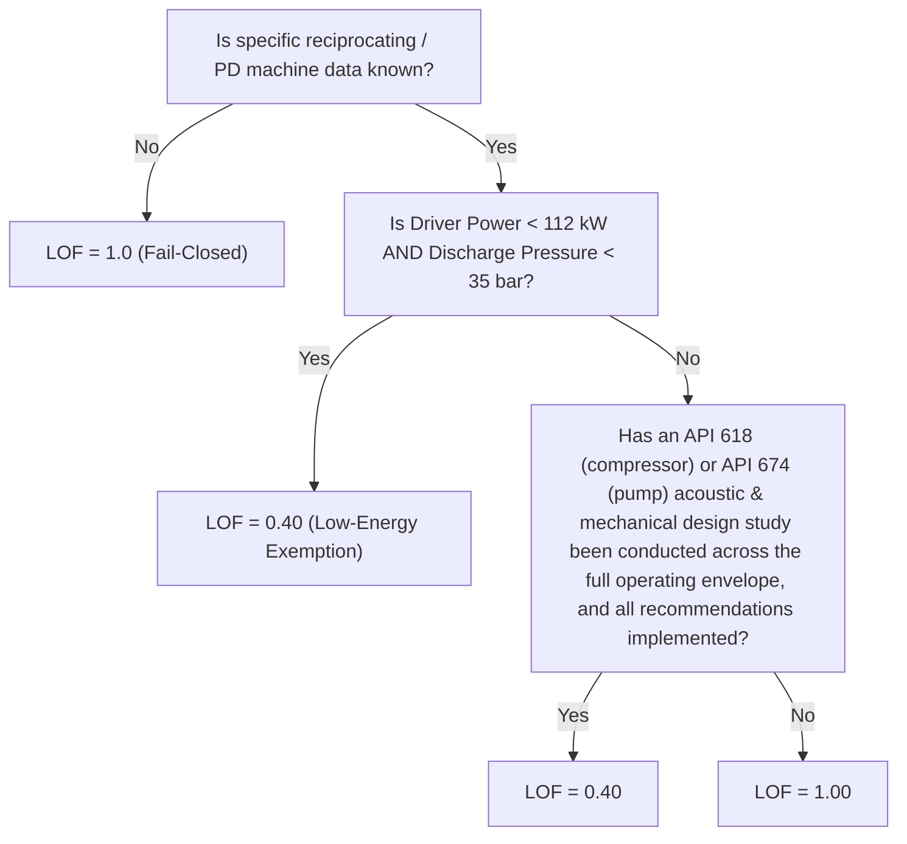
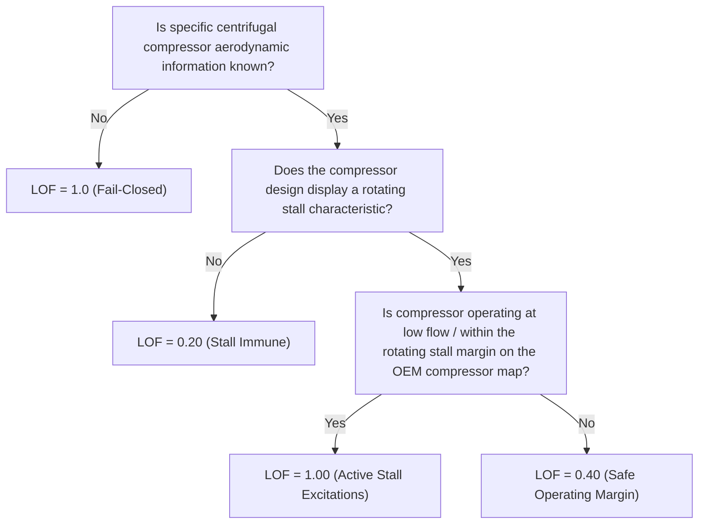

# Priority P2 — Pulsation, Rotating Stall, Deadleg & Specialist Mechanisms (Technical Modules T2.4, T2.5, T2.6 & Subsea Extensions)

*Source Document: Energy Institute — Guidelines for the Avoidance of Vibration Induced Fatigue Failure in Process Pipework (2nd Edition), Technical Module T2 (printed pages 55–60, PDF pages 63–67).*

---

## 1. T2.4 Pulsation: Reciprocating / Positive Displacement Pumps & Compressors (Flowchart T2-2)

*Printed page 55, PDF page 63.*

Pulsations generated by positive displacement machinery propagate upstream (suction) and downstream (discharge) up to the first major acoustic barrier or vessel.

### Decision Matrix

| Node | Decision Question | Thresholds / Gate | Yes Disposition | No Disposition |
| :---: | :--- | :--- | :---: | :---: |
| **1** | Machine Data Completeness | Operating speed, stroke, cylinders, pulsation bottle dimensions | Proceed to Node 2 | $\mathbf{\text{LOF} = 1.00}$ |
| **2** | Low-Energy Exemption | $\text{Power} < 112\text{ kW}$ (`150 HP`) AND $P_{\text{discharge}} < 35\text{ bar}$ (`500 psi`) | $\mathbf{\text{LOF} = 0.40}$ | Proceed to Node 3 |
| **3** | Acoustic Pulsation Study | Full API 618 Design Approach 3 (compressors) or API 674 (pumps) | $\mathbf{\text{LOF} = 0.40}$ | $\mathbf{\text{LOF} = 1.00}$ |

---

## 2. T2.5 Pulsation: Centrifugal Compressor Rotating Stall (Flowchart T2-3)

*Printed page 56, PDF page 64.*

Rotating stall occurs when aerodynamic flow separation forms rotating stall cells in the impeller or vaned/vaneless diffuser, creating sub-synchronous pressure pulsations typically at $10\% - 30\%$ of shaft running speed.

### Decision Matrix

| Node | Evaluation Gate | Condition / Source | Yes Outcome | No Outcome |
| :---: | :--- | :--- | :---: | :---: |
| **1** | Compressor Aerodynamic Data | OEM stage performance data, diffuser geometry, impeller specs | Proceed to Node 2 | $\mathbf{\text{LOF} = 1.00}$ |
| **2** | Rotating Stall Propensity | Vaneless diffuser stability, low flow surge line proximity | Proceed to Node 3 | $\mathbf{\text{LOF} = 0.20}$ |
| **3** | Low Flow Operation | Actual operating flow rate $Q \le 1.15 \times Q_{\text{stall}}$ on OEM performance map | $\mathbf{\text{LOF} = 1.00}$ | $\mathbf{\text{LOF} = 0.40}$ |

---

## 3. T2.6 Pulsation: Flow-Induced Acoustic Excitation in Deadleg Branches (Flowchart T2-4)

*Printed pages 57–59, PDF pages 65–67.*

When process fluid flows past a closed side branch (deadleg, relief line stub, bypass header), vortex shedding in the unstable shear layer across the branch mouth can couple with standing acoustic wave modes inside the deadleg, causing severe acoustic resonance.

### Mathematical Formulation

1. **Acoustic Natural Frequencies of Closed Sidebranch ($F_{s,n}$)**:
   $$F_{s,n} = \frac{(2n - 1) \cdot c}{4 \cdot (L_{\text{branch}} + \Delta L)} \quad (n = 1, 2, 3, \dots)$$
   Where:
   - $c$: Speed of sound in gas (m/s) (refer to Appendix B).
   - $L_{\text{branch}}$: Length of sidebranch from parent pipe wall to closed valve face (m).
   - $\Delta L$: Mouth acoustic end-correction: $\Delta L \approx 0.3 \cdot (d_{\text{int}} \times 10^{-3})\text{ m}$.
   - $d_{\text{int}}$: Internal diameter of sidebranch (mm).

2. **Vortex Shedding Shear-Layer Frequency ($f_{\text{shed}}$)**:
   $$f_{\text{shed}} = \frac{St \cdot v}{d_{\text{int}} \times 10^{-3}}$$
   Where:
   - $v$: Mean gas velocity in the main line (m/s).
   - $St$: Shear-layer Strouhal number (typically $0.35 \le St \le 0.60$; standard screening default $St = 0.42$).

3. **Lock-In Coincidence Criterion**:
   $$\text{Acoustic Lock-in active if: } |f_{\text{shed}} - F_{s,n}| \le 0.10 \cdot F_{s,n}$$

### Screening Assessment Disposition (Flowchart T2-4)

| Screening Step | Parameter Condition | Outcome Disposition |
| :---: | :--- | :--- |
| **Step 1** | Main Line Fluid Velocity: $v \le 5.0\text{ m/s}$ | $\mathbf{\text{LOF} = 0.20}$ (Insufficient kinetic energy to sustain acoustic lock-in). |
| **Step 2** | Branch-to-Header Diameter Ratio: $d_{\text{int}} / D_{\text{int}} < 0.10$ | $\mathbf{\text{LOF} = 0.20}$ (Negligible acoustic shear layer coupling). |
| **Step 3** | Acoustic Lock-In Check: $0.90 F_s \le f_{\text{shed}} \le 1.10 F_s$ | If True $\implies \mathbf{\text{LOF} = 1.00}$ (Acoustic resonance active). If False $\implies \mathbf{\text{LOF} = 0.20}$ (Off-resonance). |

---

## 4. Specialist Mechanism Packages

### 4.1 Subsea AVIFF Corrugation Pulsation (E4.3 / Flexible Risers)

In unlined flexible pipes or subsea corrugated jumpers, high-velocity dry gas flow over internal carcass corrugations generates high-frequency acoustic singing.
- **Corrugation Shedding Frequency**:
  $$f_{\text{corrugation}} = \frac{v_{\text{gas}}}{\lambda_{\text{pitch}}}$$
  Where $\lambda_{\text{pitch}}$ is the carcass corrugation pitch (typically $10 - 25\text{ mm}$).
- **Resonance Criterion**:
  If $f_{\text{corrugation}}$ coincides with an acoustic cross-mode or longitudinal standing wave of the jumper ($0.85 f_{\text{acoustic}} \le f_{\text{corrugation}} \le 1.15 f_{\text{acoustic}}$) $\implies \mathbf{\text{LOF} = 1.00}$.

### 4.2 Hydrodynamic Slug Flow Assessment

Hydrodynamic slugs in multiphase pipelines exert intermittent dynamic impact forces on elbows, tees, and pipe supports.
- **Dynamic Slug Force on Elbow ($F_{\text{slug}}$)**:
  $$F_{\text{slug}} = \rho_{\text{mix}} \cdot A_{\text{pipe}} \cdot v_{\text{slug}}^2 \cdot \sqrt{2(1 - \cos \theta)} + \Delta P_{\text{slug}} \cdot A_{\text{pipe}}$$
- **Screening Rule**:
  - If multiphase momentum $(\rho v^2)_{\text{mix}} > 5000\text{ kg/(m}\cdot\text{s}^2)$ and flow regime falls in the slug/plug domain on the Taitel-Dukler multiphase flow regime map $\implies \mathbf{\text{LOF} = 1.00}$.
  - Requires dynamic transient time-history structural FEA (or LFEA) with hold-down clamp qualification.
