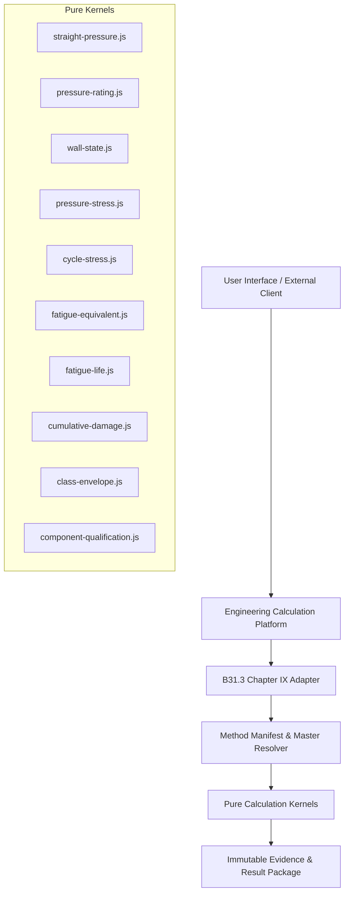
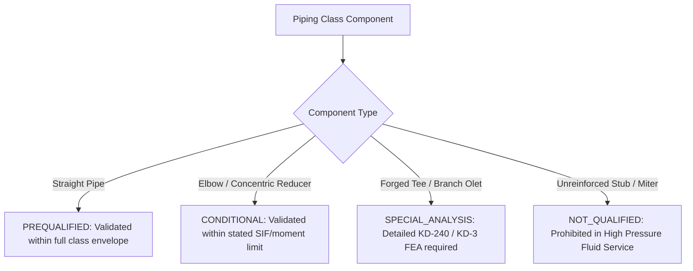

# ASME B31.3 Chapter IX & BPVC Section VIII Division 3 Master Specification

## Document Identification
- **Document ID**: `SPEC-B313-CH9-CORE-001`
- **Revision**: `1.0.0`
- **Application**: High Pressure Fluid Service Piping Engineering Platform
- **Governing Codes**: ASME B31.3-2024 Chapter IX, ASME BPVC Section VIII Division 3 (2025/2023/2021) Articles KD-2 & KD-3, ASME B31J-2020

---

## 1. Executive Summary & Engineering Scope
This specification establishes the authoritative engineering mechanics, governed master data schemas, numerical algorithms, wall-state progression, component qualification framework, and verification benchmarks for **ASME B31.3 Chapter IX High Pressure Fluid Service** piping systems.

The core architecture strictly enforces that this system operates as a **B31.3 Chapter IX High Pressure Piping Calculation Engine** that invokes qualified **ASME BPVC Section VIII Division 3 Articles KD-2 and KD-3** methods under strict method manifests. It rejects unverified user overrides, naive edition-year equality, unconstrained linear property extrapolation, and unquantified class-wide fatigue qualification.



---

## 2. Engineering Mechanics & Mathematical Formulations

### 2.1 B31.3 Chapter IX Paragraph K304.1.2 — Straight Pipe Pressure Design
For high pressure piping, the required pressure design wall thickness $t$ for straight pipe under internal design pressure $P$ and allowable stress $S$ (from Table K-1) is based on the Lamé / Tresca formulation:

$$t = \frac{D}{2} \left(1 - \exp\left(-\frac{P}{S}\right)\right)$$

where:
- $D = \text{outside diameter of pipe (mm)}$
- $P = \text{internal design pressure (MPa)}$
- $S = \text{basic allowable stress at design temperature from ASME B31.3 Table K-1 (MPa)}$

The minimum required wall thickness including mechanical, corrosion, and erosion allowances is:
$$t_m = t + c = t + c_i + c_o$$
where:
- $c_i = \text{internal corrosion and erosion allowance (mm)}$
- $c_o = \text{external corrosion and machining allowance (mm)}$

The selected pipe schedule or product provides nominal thickness $t_{nom}$. Accounting for the mill minus manufacturing tolerance $tol$ (%):
$$t_{min,m} = t_{nom} \left(1 - \frac{tol}{100}\right)$$

Static pressure compliance requires:
$$t_{min,m} \ge t_m$$

The effective net wall thickness available at End-of-Life ($EOL$) for pressure containment and fatigue is:
$$t_{eff} = t_{min,m} - c_i - c_o$$

The maximum allowable internal pressure rating $P_{rating}$ of the selected pipe at design temperature is:
$$P_{rating} = S \cdot \ln\left(\frac{D}{D - 2 t_{eff}}\right) = S \cdot \ln(Y)$$
where the diameter ratio is:
$$Y = \frac{D}{D - 2 t_{eff}} = \frac{D_O}{D_I}$$

Static pressure capacity margin:
$$\text{Margin} = \frac{P_{rating}}{P} \ge 1.000$$

---

### 2.2 ASME BPVC Section VIII Division 3 Article KD-2 — Monobloc Cylinder Elastic Stresses
Per ASME BPVC Section VIII Division 3 Paragraph KD-260, the elastic stresses in a thick-walled monobloc circular cylinder of uniform wall thickness remote from discontinuities under internal pressure $P$ are:

#### Tangential (Hoop) Stress:
$$\sigma_t(r) = \frac{P}{Y^2 - 1} \left(1 + \frac{r_o^2}{r^2}\right)$$
At the bore inner surface ($r = r_i$, where $r_o/r_i = Y$):
$$\sigma_t(r_i) = P \frac{Y^2 + 1}{Y^2 - 1}$$

#### Radial Stress:
$$\sigma_r(r) = \frac{P}{Y^2 - 1} \left(1 - \frac{r_o^2}{r^2}\right)$$
At the bore inner surface ($r = r_i$):
$$\sigma_r(r_i) = -P$$

#### Longitudinal (Axial) Stress (Closed End Condition):
$$\sigma_l = \frac{P}{Y^2 - 1}$$

#### Stress Differences and Stress Intensity:
The principal stresses are $\sigma_1 = \sigma_t$, $\sigma_2 = \sigma_l$, $\sigma_3 = \sigma_r$. The principal stress differences are:
$$S_{12} = \sigma_t - \sigma_l = P \frac{(Y^2 + 1) - 1}{Y^2 - 1} = P \frac{Y^2}{Y^2 - 1}$$
$$S_{23} = \sigma_l - \sigma_r = \frac{P}{Y^2 - 1} - (-P) = P \frac{1 + (Y^2 - 1)}{Y^2 - 1} = P \frac{Y^2}{Y^2 - 1}$$
$$S_{31} = \sigma_r - \sigma_t = -P - P \frac{Y^2 + 1}{Y^2 - 1} = -P \left(\frac{Y^2 - 1 + Y^2 + 1}{Y^2 - 1}\right) = -2 P \frac{Y^2}{Y^2 - 1}$$

The maximum Tresca stress intensity $S_p$ occurs at the inner bore surface:
$$S_p = \max(|S_{12}|, |S_{23}|, |S_{31}|) = |S_{31}| = 2 P \frac{Y^2}{Y^2 - 1}$$

---

### 2.3 ASME BPVC Section VIII Division 3 Article KD-3 — Fatigue Evaluation

#### Alternating Stress Intensity $S_{alt}$:
For an operating cycle transitioning between State $A$ (internal pressure $P_A$) and State $B$ (internal pressure $P_B$):
$$\Delta P = |P_B - P_A|$$
The range of stress intensity is:
$$\Delta S_p = |S_p(P_B) - S_p(P_A)| = 2 \Delta P \frac{Y^2}{Y^2 - 1}$$

The alternating stress intensity $S_{alt}$ is defined as half the stress intensity range:
$$S_{alt} = \frac{1}{2} \Delta S_p = \Delta P \frac{Y^2}{Y^2 - 1}$$

#### Equivalent Alternating Stress $S_{eq}$ (Mean Stress Correction per KD-320):
When mean stress correction is active per Paragraph KD-320:
$$S_{eq} = \frac{S_{alt}}{1 - \beta \cdot \frac{\sigma_{mean}}{S_y}}$$
where $\beta$ is the code-defined mean stress sensitivity factor and $\sigma_{mean}$ is the cycle mean stress. For pure straight-pipe pressure cycles without mean stress sensitivity or when $\beta = 0$, $S_{eq} = S_{alt}$.

#### Permissible Cycles $N_i$ via Log-Log Curve Interpolation:
Given a qualified design fatigue curve with discrete points $(N_j, S_{a,j})$, the permissible cycle count $N_i$ for calculated equivalent stress $S_{eq}$ between bounding points $(N_1, S_{a1})$ and $(N_2, S_{a2})$ is computed via log-log interpolation:

$$\log_{10}(N_i) = \log_{10}(N_1) + \frac{\log_{10}(S_{eq}) - \log_{10}(S_{a1})}{\log_{10}(S_{a2}) - \log_{10}(S_{a1})} \cdot \left(\log_{10}(N_2) - \log_{10}(N_1)\right)$$
$$N_i = 10^{\log_{10}(N_i)}$$

> [!CAUTION]
> **Strict Guard Invariant**: Extrapolation beyond the curve minimum or maximum stress limits is strictly **PROHIBITED** (`extrapolation_allowed = FALSE`). If $S_{eq} > S_{a,max}$ or $S_{eq} < S_{a,min}$, the engine immediately throws `BLOCKED_NO_EXTRAPOLATION`.

#### Cumulative Damage (Palmgren-Miner Rule):
For a spectrum of $k$ operational transients, each with applied cycle count $n_i$ and permissible cycles $N_i$:
$$U_i = \frac{n_i}{N_i}$$
The cumulative fatigue usage factor $U$ is:
$$U = \sum_{i=1}^{k} U_i = \sum_{i=1}^{k} \frac{n_i}{N_i} \le 1.0000$$

---

## 3. Five-Stage Wall-State Custody Model
Ambiguous wall thickness definitions represent a critical safety risk in high pressure fatigue design. The calculation engine rigorously distinguishes five distinct wall states:

| State Code | Stage Name | Mathematical Definition | Application / Custody |
|---|---|---|---|
| `NOMINAL` | Nominal Design Wall | $t_{nom}$ | Catalog / specification callout |
| `MANUFACTURED_MIN` | Minimum Manufactured Wall | $t_{min,m} = t_{nom}(1 - tol/100)$ | Mill acceptance & initial static check |
| `BOL_NET` | Beginning-of-Life Net Wall | $t_{BOL,net} = t_{min,m} - c_{ext,0} - c_{int,0}$ | Pre-commissioning hydrotest & initial cycle |
| `EOL_NET` | End-of-Life Net Wall | $t_{EOL,net} = t_{min,m} - c_i - c_o$ | **Governing Design Fatigue & Rating State** |
| `CURRENT_MEASURED` | In-Service Measured Wall | $t_{measured} \to t_{rem} = t_{measured} - c_{future}$ | Brownfield remaining life evaluation |

Every calculation result payload explicitly returns the wall state metadata:
```json
{
  "wallState": "EOL_NET",
  "nominalWallMm": 13.49,
  "minusTolerancePct": 12.5,
  "minimumManufacturedWallMm": 11.80375,
  "internalCorrosionAllowanceMm": 3.0,
  "externalCorrosionAllowanceMm": 0.0,
  "effectiveWallMm": 8.80375,
  "diameterRatioY": 1.182103
}
```

---

## 4. Four-Tier Component Qualification Framework
A piping class fatigue qualification cannot be claimed from straight-pipe equations alone. The engine enforces component-level evaluation across four authoritative tiers:



1. **`PREQUALIFIED`**: Component is mathematically verified across the entire declared class $\Delta P - N$ envelope without external moment restrictions (e.g. seamless straight pipe).
2. **`CONDITIONAL`**: Component is qualified subject to explicit verified constraints (e.g. B31J SIF limits, maximum taper angle $\le 30^\circ$, sustained thermal moment limits).
3. **`SPECIAL_ANALYSIS`**: Component possesses complex geometry or stress concentrations requiring independent 3D continuum FEA per KD-240 and local fatigue evaluation per KD-3 / KD-4.
4. **`NOT_QUALIFIED`**: Prohibited component geometry for Chapter IX fluid service (e.g. unreinforced fabricated branch, miter bend).

---

## 5. Master Data Schemas and Dictionary

The system is governed by 22 canonical master tables stored in CSV format:

### 5.1 Authority Masters
- [`code_source_revision.csv`](file:///F:/CODE-6/Advanced_Analysis/docs/High%20Pr/code_source_revision.csv): `source_id, standard, edition, addenda, document_title, document_hash, license_class, storage_class, source_locator, verified_by, verified_at, status`
- [`method_manifest.csv`](file:///F:/CODE-6/Advanced_Analysis/docs/High%20Pr/method_manifest.csv): `method_id, method_revision, application_scope, b313_edition, b313_scope, viii3_source_id, kd2_method_id, kd3_method_id, kd4_policy_id, b31j_edition, material_property_policy_id, fatigue_route_id, effective_from, qualification_state, verified_by, verified_at`

### 5.2 Material Masters
- [`material_identity.csv`](file:///F:/CODE-6/Advanced_Analysis/docs/High%20Pr/material_identity.csv): `material_id, specification, grade, condition, product_form, uns_number, material_family, notes, status`
- [`material_property.csv`](file:///F:/CODE-6/Advanced_Analysis/docs/High%20Pr/material_property.csv): `material_id, method_revision, temperature_c, allowable_stress_mpa, yield_strength_mpa, tensile_strength_mpa, elastic_modulus_mpa, poisson_ratio, alpha_per_c, density_kg_m3, source_id, source_locator, interpolation_rule, qualification_state`

### 5.3 Pipe Geometry & Product Masters
- [`pipe_dimension.csv`](file:///F:/CODE-6/Advanced_Analysis/docs/High%20Pr/pipe_dimension.csv): `dimension_id, nps, od_mm, schedule, nominal_wall_mm, bore_mm, dimension_standard, dimension_edition, source_id, status`
- [`pipe_product.csv`](file:///F:/CODE-6/Advanced_Analysis/docs/High%20Pr/pipe_product.csv): `product_id, dimension_id, material_id, product_spec, manufacturing_process, design_d_max_mm, nominal_wall_mm, minus_tolerance_pct, tolerance_basis, source_id, source_locator, status`

### 5.4 Corrosion & Wall-State Master
- [`corrosion_model.csv`](file:///F:/CODE-6/Advanced_Analysis/docs/High%20Pr/corrosion_model.csv): `corrosion_model_id, mechanism, internal_ca_mm, external_ca_mm, erosion_allowance_mm, corrosion_rate_mm_per_year, design_life_years, localized_corrosion_flag, inspection_basis, source_id, status`

### 5.5 Transient & Cycle Spectrum Masters
- [`cycle_spectrum.csv`](file:///F:/CODE-6/Advanced_Analysis/docs/High%20Pr/cycle_spectrum.csv): `spectrum_id, project_id, class_id, revision, design_life_years, source_document, source_revision, prepared_by, checked_by, approved_by, status`
- [`operating_state.csv`](file:///F:/CODE-6/Advanced_Analysis/docs/High%20Pr/operating_state.csv): `spectrum_id, state_id, state_name, pressure_mpa, material_temperature_c, structural_temperature_c, duration_hr, provenance_id, status`
- [`cycle_transition.csv`](file:///F:/CODE-6/Advanced_Analysis/docs/High%20Pr/cycle_transition.csv): `spectrum_id, cycle_id, from_state_id, to_state_id, category, cycles_per_year, total_cycles, provenance_id, approved_by, status`

### 5.6 KD / Fatigue Masters
- [`fatigue_route.csv`](file:///F:/CODE-6/Advanced_Analysis/docs/High%20Pr/fatigue_route.csv): `fatigue_route_id, method_revision, kd_route_id, stress_basis, seq_route, mean_stress_route, fatigue_curve_id, interpolation_rule, extrapolation_allowed, applicability, source_id, qualification_state`
- [`fatigue_curve.csv`](file:///F:/CODE-6/Advanced_Analysis/docs/High%20Pr/fatigue_curve.csv): `fatigue_curve_id, standard, edition, material_scope, temp_min_c, temp_max_c, environment_scope, mean_stress_embedded, source_id, source_locator, license_class, qualification_state`
- [`fatigue_curve_point.csv`](file:///F:/CODE-6/Advanced_Analysis/docs/High%20Pr/fatigue_curve_point.csv): `fatigue_curve_id, point_no, n_cycles, sa_mpa, source_locator, verified_by, verified_at`

### 5.7 Component & Stress Factor Masters
- [`component_catalog.csv`](file:///F:/CODE-6/Advanced_Analysis/docs/High%20Pr/component_catalog.csv): `component_id, component_type, standard, standard_edition, run_nps, branch_nps, class_or_schedule, geometry_key, material_family, source_id, status`
- [`sif_stress_index.csv`](file:///F:/CODE-6/Advanced_Analysis/docs/High%20Pr/sif_stress_index.csv): `geometry_key, method_id, b31j_edition, ii, io, flexibility_in_plane, flexibility_out_plane, stress_index_1, stress_index_2, stress_index_3, applicability, source_id, qualification_state`
- [`component_qualification.csv`](file:///F:/CODE-6/Advanced_Analysis/docs/High%20Pr/component_qualification.csv): `qualification_id, component_id, method_revision, wall_state_basis, temp_min_c, temp_max_c, pressure_max_mpa, fatigue_envelope_id, b31j_geometry_key, fea_evidence_id, vendor_evidence_id, limitations, status, checked_by, approved_by`

### 5.8 Class & Envelope Masters
- [`piping_class.csv`](file:///F:/CODE-6/Advanced_Analysis/docs/High%20Pr/piping_class.csv): `class_id, revision, method_revision, design_pressure_mpa, design_temperature_c, design_life_years, material_family, corrosion_model_id, spectrum_id, status`
- [`piping_class_item.csv`](file:///F:/CODE-6/Advanced_Analysis/docs/High%20Pr/piping_class_item.csv): `class_id, revision, component_type, size_from_nps, size_to_nps, component_id, product_id, qualification_id, restriction, status`
- [`fatigue_envelope_point.csv`](file:///F:/CODE-6/Advanced_Analysis/docs/High%20Pr/fatigue_envelope_point.csv): `envelope_id, qualification_id, point_no, delta_p_mpa, n_allowed, temperature_c, wall_state, governing_location, governing_component, method_revision`

### 5.9 Benchmark & Governance Masters
- [`benchmark_case.csv`](file:///F:/CODE-6/Advanced_Analysis/docs/High%20Pr/benchmark_case.csv): `benchmark_id, benchmark_family, method_id, method_revision, source_type, source_id, independent, inputs_json, expected_intermediates_json, expected_result_json, tolerance_type, tolerance_value, reviewer, status`
- [`analysis_mapping.csv`](file:///F:/CODE-6/Advanced_Analysis/docs/High%20Pr/analysis_mapping.csv): `mapping_id, method_revision, caesar_version, b313_edition, b31j_edition, unit_system, material_map_id, load_case_template_id, fatigue_curve_id, status`
- [`approval_record.csv`](file:///F:/CODE-6/Advanced_Analysis/docs/High%20Pr/approval_record.csv): `object_type, object_id, revision, prepared_by, prepared_at, checked_by, checked_at, approved_by, approved_at, disposition, comment`

---

## 6. Governed Engineering Chart Specifications

| Chart ID | Chart Title | X-Axis | Y-Axis | Series / Curves | Engineering Purpose |
|---|---|---|---|---|---|
| **`HP-C01`** | Material Properties vs Temperature | Temperature ($^\circ\text{C}$) | Stress ($\text{MPa}$) | Basic Allowable $S$, Yield Strength $S_{yt}$, Tensile Strength $S_u$ | Verify property resolution & interpolation rules |
| **`HP-C02`** | Required vs Selected Wall Sizing | NPS (Nominal Pipe Size) | Thickness ($\text{mm}$) | $t_{pressure}$, $t_m$, $t_{min,m}$, $t_{EOL,net}$ | Visual class sizing verification & margin display |
| **`HP-C03`** | Static Pressure Capacity Margin | NPS | Ratio | $P_{rating} / P_{design}$ (Safety Threshold at 1.0) | Detect marginal pipe sizes across full class |
| **`HP-C04`** | $\Delta P - N$ Fatigue Capacity Envelope | Permissible Cycles $N$ (log) | Pressure Range $\Delta P$ ($\text{MPa}$) | Straight Pipe, Elbow Intrados, Reducer, Class Governing | Primary class fatigue design envelope |
| **`HP-C05`** | Transient Cycle Damage Pareto | Cycle ID (Category) | Damage Fraction $U_i$ | Sorted descending by damage contribution | Identify governing damaging operational transients |
| **`HP-C06`** | Cumulative Fatigue Usage by NPS | NPS | Usage Factor $\Sigma U_i$ | Cumulative Usage with Unity (1.0) Limit Line | Identify class governing size under spectrum |
| **`HP-C07`** | Component Qualification Matrix | NPS (Rows) | Component Type (Cols) | Status Glyphs: `PREQUAL`, `COND`, `SPEC`, `NOT_QUAL` | Verify whole-class fatigue completeness |
| **`HP-C08`** | Wall-State Progression Custody | NPS | Wall ($\text{mm}$) | $t_{nom} \to t_{min,m} \to t_{BOL,net} \to t_{EOL,net}$ | Prevent ambiguous thickness usage across lifecycle |
| **`HP-C09`** | Expected vs Calculated Benchmark | Expected Value | Engine Result | Identity parity line ($y = x$) | Automated numerical qualification gate |
| **`HP-C10`** | CAESAR II / Kernel Parity | Benchmark Case | Relative Difference (%) | $\Delta S_p$, $S_{alt}$, $N_i$ Parity Lines | External solver handoff quality assurance |
| **`HP-C11`** | Authority Coverage Matrix | Method Manifests | Authority Elements | Source, Material, Product, Curve, Benchmark Status | Release readiness certification |

---

## 7. Stable Calculation IDs and Execution Pipeline

| Calculation ID | Primary Responsibility | Input Contract | Output Contract |
|---|---|---|---|
| `PIPE.B313.CH9.STRAIGHT_PRESSURE` | Calculate required pressure wall $t$ and $t_m$ | $D, P, S, c_i, c_o$ | $t, t_m, \text{equation\_evidence}$ |
| `PIPE.B313.CH9.PRESSURE_RATING` | Calculate maximum pressure rating $P_{rating}$ | $D, t_{eff}, S$ | $P_{rating}, \text{margin}, \text{status}$ |
| `PIPE.B313.CH9.WALL_STATE` | Resolve 5-stage wall thickness custody | $t_{nom}, tol, c_i, c_o$ | $t_{min,m}, t_{BOL,net}, t_{EOL,net}, t_{eff}$ |
| `PIPE.B313.CH9.PRESSURE_STRESS` | Derive Lamé 3D stress tensor at bore | $D, t_{eff}, P$ | $\sigma_t, \sigma_r, \sigma_l, S_p$ |
| `PIPE.B313.CH9.CYCLE_RANGE` | Compute transient stress difference & range | $\text{State}_A, \text{State}_B, t_{eff}$ | $\Delta \sigma_t, \Delta \sigma_r, \Delta S_p$ |
| `PIPE.B313.CH9.FATIGUE_EQUIVALENT` | Resolve $S_{alt} \to S_{eq}$ per qualified route | $\Delta S_p, \sigma_{mean}, \beta, S_y$ | $S_{alt}, S_{eq}, \text{route\_id}$ |
| `PIPE.B313.CH9.FATIGUE_LIFE` | Interpolate design curve $\to N_i$ | $S_{eq}, \text{curve\_id}$ | $N_i, \text{interpolation\_basis}$ |
| `PIPE.B313.CH9.CYCLE_USAGE` | Calculate $U_i = n_i/N_i$ and $\sum U_i$ | $\{n_i\}, \{N_i\}$ | $\{U_i\}, U_{total}, \text{verdict}$ |
| `PIPE.B313.CH9.CLASS_MATRIX` | Batch evaluate NPS $\times$ Schedule $\times$ Spectrum | $\text{Class\_ID}, \text{Spectrum\_ID}$ | Full NPS Table with status & governing detail |
| `PIPE.B313.CH9.CLASS_ENVELOPE` | Invert fatigue equations $\to \Delta P - N$ curve | $\text{Class\_ID}, \{\Delta P\}$ | Envelope curve points & governing component |
| `PIPE.B313.CH9.COMPONENT_QUALIFICATION` | Adjudicate component fatigue & SIF | $\text{Component\_ID}, \text{Loads}$ | $\text{Tier Status}, \text{Limitations}, \text{Evidence}$ |
| `PIPE.B313.CH9.SYSTEM_HANDOFF` | Compile CAESAR / FEA load contract | $\text{Class\_ID}, \text{Piping\_Model}$ | Sealed neutral analysis package |

---

## 8. Immutable Calculation Result Contract
Every calculation performed by the engine returns a deeply frozen JSON response conforming to the five-block architecture:

```json
{
  "calculation": {
    "calculationId": "PIPE.B313.CH9.FATIGUE_LIFE",
    "calculationVersion": "1.0.0",
    "timestamp": "2026-08-15T09:45:00Z"
  },
  "inputsResolved": {
    "methodId": "B313-CH9-PF-2024-R1",
    "materialId": "MAT-CS-A106-B",
    "nps": 4.0,
    "outsideDiameterMm": 114.3,
    "nominalWallMm": 13.49,
    "minusTolerancePct": 12.5,
    "corrosionAllowanceMm": 3.0,
    "effectiveWallMm": 8.80375,
    "pminMpa": 2.0,
    "pmaxMpa": 20.0,
    "appliedCycles": 5000.0
  },
  "intermediates": {
    "diameterRatioY": 1.182103,
    "boreStressIntensityMinMpa": 14.066554625,
    "boreStressIntensityMaxMpa": 140.665546246,
    "deltaStressIntensityMpa": 126.598991621,
    "alternatingStressSaltMpa": 63.299495811,
    "equivalentStressSeqMpa": 63.299495811
  },
  "result": {
    "permissibleCyclesNi": 450000.0,
    "cycleUsageFractionUi": 0.011111,
    "cumulativeUsageFactor": 0.011111,
    "fatigueCompliance": "PASS_BELOW_UNITY"
  },
  "evidence": {
    "b313Edition": "2024",
    "viii3SourceId": "SRC-VIII3-2025",
    "kd2MethodId": "KD2-ELASTIC-001",
    "kd3MethodId": "KD3-FATIGUE-001",
    "fatigueCurveId": "VIII3-KD3-CS-001",
    "materialPropertyPolicyId": "MAT-PROP-001",
    "qualificationState": "APPROVED",
    "benchmarkQualificationRevision": "1.0.0"
  }
}
```
