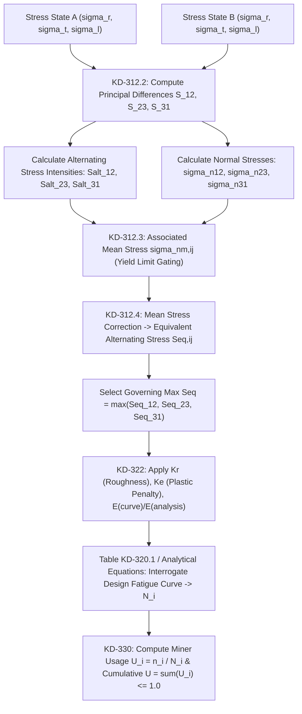

# ASME Section VIII Division 3 Article KD-3 — Fatigue Evaluation Authority Package

**Controlled Standard Reference:** ASME Boiler & Pressure Vessel Code, Section VIII, Division 3: *Alternative Rules for Construction of High Pressure Vessels*, Part KD, Article KD-3: *Fatigue Evaluation* (2013 Edition).  
**Controlled Source PDF:** `kd-3.pdf`  
**Controlled Source SHA-256:** `4dbba73ad342e69b3b755de392a987df634a917ba7fa2f66b072b32bf93ee6c7`  
**Governing Paragraphs:** KD-300, KD-301, KD-302, KD-310, KD-311, KD-312, KD-313, KD-320, KD-321, KD-322, KD-323, KD-330, KD-340, KD-350, Table KD-320.1, Figures KD-320.1 to KD-320.7.

---

## 1. Complete End-to-End Fatigue Calculation Chain

---

## 2. KD-3.1 & KD-3.2: Stress-Pair Selection & Alternating Stress Intensity

### 2.1 Principle of Fixed Principal Axes (Paragraph KD-312)
For high pressure piping where principal stress directions remain aligned with the cylindrical axes $(r, \theta, z)$ across the operating transient cycle:
1. **Principal Stress Differences for State $k$:**
   $$S_{12,k} = \sigma_{1,k} - \sigma_{2,k} = \sigma_{t,k} - \sigma_{l,k} \quad \text{[KD-312.1]}$$
   $$S_{23,k} = \sigma_{2,k} - \sigma_{3,k} = \sigma_{l,k} - \sigma_{r,k} \quad \text{[KD-312.2]}$$
   $$S_{31,k} = \sigma_{3,k} - \sigma_{1,k} = \sigma_{r,k} - \sigma_{t,k} \quad \text{[KD-312.3]}$$
2. **Identify Extremes for Each Plane ($ij \in \{12, 23, 31\}$):**
   * $S_{ij,\max} = \max_k (S_{ij,k})$ (algebraic maximum maintaining proper sign)
   * $S_{ij,\min} = \min_k (S_{ij,k})$ (algebraic minimum maintaining proper sign)
3. **Alternating Stress Intensity ($S_{alt,ij}$):**
   $$S_{alt,ij} = 0.5 \left( S_{ij,\max} - S_{ij,\min} \right) \quad \text{[KD-312.4]}$$
   * $S_{alt,ij} \ge 0$ (amplitude is strictly non-negative).
   * All three planes ($12, 23, 31$) must be evaluated independently.

---

## 3. KD-3.3 & KD-3.4: Associated Mean Stress & Yield Gating

### 3.1 Normal Stress on Maximum Shear Plane
The normal stress $\sigma_n$ on the plane of maximum shear for each pair is:
$$\sigma_{n12} = 0.5 (\sigma_1 + \sigma_2) \quad \text{[KD-312.5]}$$
$$\sigma_{n23} = 0.5 (\sigma_2 + \sigma_3) \quad \text{[KD-312.6]}$$
$$\sigma_{n31} = 0.5 (\sigma_3 + \sigma_1) \quad \text{[KD-312.7]}$$

### 3.2 Associated Mean Stress Evaluation ($\sigma_{nm,ij}$)

#### A. Compressive Mean Stress ($\sigma_{n,ij} < 0$ or Autofrettaged Shells):
1. When $S_{ij,\max} < S_y$ and $S_{ij,\min} > -S_y$:
   $$\sigma_{nm,ij} = 0.5 \left( \sigma_{n,ij,\max} + \sigma_{n,ij,\min} \right) \quad \text{[KD-312.8]}$$
2. When $S_{alt,ij} \ge S_y$:
   $$\sigma_{nm,ij} = 0 \quad \text{(Shakedown washes out mean stress) [KD-312.9]}$$

#### B. Tensile Mean Stress ($\sigma_{n,ij} > 0$, Nonautofrettaged Vessels):
1. When $S_{ij,\max} < S_y / 2$ and $S_{ij,\min} > -S_y / 2$:
   $$\sigma_{nm,ij} = 0.5 \left( \sigma_{n,ij,\max} + \sigma_{n,ij,\min} \right) \quad \text{[KD-312.10]}$$
2. When $S_{alt,ij} \ge S_y / 2$:
   $$\sigma_{nm,ij} = 0 \quad \text{[KD-312.11]}$$
3. If neither (1) nor (2) applies, calculate $\sigma_{nm,ij} = 0.5(\sigma_{n,ij,\max} + \sigma_{n,ij,\min})$, but not less than zero, or perform elastic-plastic analysis.

---

## 4. KD-3.5: Equivalent Alternating Stress Intensity ($S_{eq}$)

### 4.1 Mean-Stress Corrected Equation (Paragraph KD-312.4(b))
For forged nonwelded carbon/low alloy steel or high-strength stainless steels:
$$S_{eq,ij} = S_{alt,ij} \cdot \left( \frac{1}{1 - \frac{\beta \cdot \sigma_{nm,ij}}{S_a'}} \right) \quad \text{[KD-312.13]}$$

Where:
* $S_a'$ = Allowable alternating stress amplitude at $N = 10^6\text{ cycles}$ with $\sigma_{nm} = 0$ (from KD-321 / Table KD-320.1):
  * For Forged Carbon/Low Alloy Steel ($UTS = 90\text{ ksi}$): $S_a' = 19.0\text{ ksi}$ ($131\text{ MPa}$).
  * For Forged Carbon/Low Alloy Steel ($UTS \ge 125\text{ ksi}$): $S_a' = 26.0\text{ ksi}$ ($179\text{ MPa}$).
  * For 17-4PH / 15-5PH Stainless: $S_a' = 42.8\text{ ksi}$ ($295\text{ MPa}$).
* $\beta$ = Mean stress sensitivity factor:
  * $\beta = 0.20$ for forged carbon/low alloy steels (Figure KD-320.1).
  * $\beta = 0.20$ (for $\sigma_{nm,ij} < 0$) and $\beta = 0.50$ (for $\sigma_{nm,ij} > 0$) for 17-4PH/15-5PH stainless (Figure KD-320.4).
* **Denominator Safeguard Limit:** If $\frac{\beta \sigma_{nm,ij}}{S_a'} > 0.90$, limit the value of the term to $0.90$ (maximum multiplier $= 10.0$).

### 4.2 Materials Without Mean-Stress Correction (Paragraph KD-312.4(a))
For nonwelded carbon/low alloy steels with $S_u < 90\text{ ksi}$ ($620\text{ MPa}$), austenitic stainless steels, and aluminum alloys:
$$S_{eq,ij} = S_{alt,ij} \quad \text{[KD-312.12]}$$

### 4.3 Governing Equivalent Alternating Stress:
$$S_{eq} = \max\left( S_{eq,12}, \; S_{eq,23}, \; S_{eq,31} \right)$$

---

## 5. KD-3.6 & KD-3.7: Fatigue Curve Selection & Numerical Data

### 5.1 Final Design Alternating Stress ($S_a$)
Before interrogating the design fatigue curve, $S_{eq}$ is adjusted for surface finish, plastic penalty, and temperature-dependent modulus:
$$S_a = K_r \cdot K_e \cdot S_{eq} \cdot \left( \frac{E_{\text{curve}}}{E_{\text{analysis}}} \right) \quad \text{[KD-322.4]}$$

Where:
* $K_r$ = Surface roughness factor ($K_r = 1.0$ for machined surfaces with $R_a \le 19\text{ }\mu\text{in}$ / $0.5\text{ }\mu\text{m}$; otherwise determined from Figure KD-320.6).
* $K_e$ = Fatigue penalty factor (KD-322.1–322.3):
  * $K_e = 1.0$ for $\Delta S_n \le 2 S_y$
  * $K_e = 1.0 + \frac{1-n}{n(m-1)} \left( \frac{\Delta S_n}{2 S_y} - 1 \right)$ for $2 S_y < \Delta S_n < 2 m S_y$
  * $K_e = 1/n$ for $\Delta S_n \ge 2 m S_y$
* $E_{\text{curve}}$ = Reference elastic modulus of design fatigue curve ($28.3 \times 10^6\text{ psi}$ for CS/LAS forged).
* $E_{\text{analysis}}$ = Actual elastic modulus of material at operating temperature.

---

### 5.2 Table KD-320.1 Discrete Master Curve Data (Values of $S_a$ in ksi)

| Design Cycles $N_f$ | CS/LAS Forged (UTS 90 ksi) | CS/LAS Forged (UTS $\ge$ 125 ksi) | CS/LAS Nonwelded (UTS $\le$ 80 ksi) | CS/LAS Nonwelded (UTS 115-130 ksi) | Austenitic Stainless Steel | 17-4PH / 15-5PH Stainless | HSLA Bolting |
| :---: | :---: | :---: | :---: | :---: | :---: | :---: | :---: |
| **$5 \times 10^1$** | 311 | 317 | 275 | 230 | 345 | 205 | 450 |
| **$1 \times 10^2$** | 226 | 233 | 205 | 175 | 261 | 171 | 300 |
| **$2 \times 10^2$** | 164 | 171 | 155 | 135 | 201 | 149 | 205 |
| **$5 \times 10^2$** | 113 | 121 | 105 | 100 | 148 | 129 | 122 |
| **$1 \times 10^3$** | 89 | 98 | 83 | 78 | 119 | 103 | 81 |
| **$2 \times 10^3$** | 72 | 82 | 64 | 62 | 97 | 86.1 | 55 |
| **$5 \times 10^3$** | 57 | 68 | 48 | 49 | 76 | 72.0 | 33 |
| **$1 \times 10^4$** | 49 | 61 | 38 | 44 | 64 | 65.1 | 22.5 |
| **$2 \times 10^4$** | 43 | 49 | 31 | 36 | 56 | 60.0 | 15.0 |
| **$5 \times 10^4$** | 34 | 39 | 23 | 29 | 46 | 54.8 | 10.5 |
| **$1 \times 10^5$** | 29 | 34 | 20 | 26 | 41 | 51.6 | 8.4 |
| **$2 \times 10^5$** | 25 | 31 | 16.5 | 24 | 36 | 48.7 | 7.1 |
| **$5 \times 10^5$** | 21 | 28 | 13.5 | 22 | 31 | 45.2 | 6.0 |
| **$1 \times 10^6$** | 19 | 26 | 12.5 | 20 | 28 | 42.8 | 5.3 |
| **$2 \times 10^6$** | 17 | 24 | 12.1 | 19.3 | — | 40.6 | — |
| **$5 \times 10^6$** | 16.2 | 22.9 | 11.5 | 18.5 | — | 37.8 | — |
| **$1 \times 10^7$** | 15.7 | 22.1 | 11.1 | 17.8 | — | 35.9 | — |
| **$2 \times 10^7$** | 15.2 | 21.4 | 10.8 | 17.2 | — | — | — |
| **$5 \times 10^7$** | 14.5 | 20.4 | 10.3 | 16.4 | — | — | — |
| **$1 \times 10^8$** | 14.0 | 19.7 | 9.9 | 15.9 | — | — | — |

---

### 5.3 KD-3.8: Log-Log Interpolation Rule (General Note (c))
For an entered stress value $S_a$ lying between two tabulated stress levels $S_i > S_a > S_j$ corresponding to tabulated cycle points $N_i < N_j$:
$$\frac{N}{N_i} = \left( \frac{N_j}{N_i} \right)^{\frac{\log_{10}(S_i / S_a)}{\log_{10}(S_i / S_j)}}$$
$$N = N_i \cdot 10^{\left[ \log_{10}\left(\frac{N_j}{N_i}\right) \cdot \frac{\log_{10}(S_i / S_a)}{\log_{10}(S_i / S_j)} \right]}$$

---

### 5.4 KD-3.8: Exact Analytical Curve Fit Formulations (General Note (d))

#### 1. Figure KD-320.1 (Forged Carbon / Low Alloy Steel, $UTS = 90\text{ ksi}$):
* **High Stress Range ($311\text{ ksi} \ge S_a \ge 42.6\text{ ksi}$):**
  $$N = \exp\left[ 15.433 - 2.0301 \ln(S_a) + 1036.035 \left( \frac{\ln(S_a)}{S_a^2} \right) \right]$$
* **Intermediate Range ($17.0\text{ ksi} < S_a < 42.6\text{ ksi}$):**
  $$N = \left[ 2.127\times 10^{-5} + 7.259\times 10^{-10} S_a^3 - 8.636\times 10^{-6} \ln(S_a) \right]^{-1}$$
* **Low Stress / High Cycle Range ($17.0\text{ ksi} \ge S_a \ge 14.0\text{ ksi}$):**
  $$N = \exp\left[ -20.0 \ln\left( \frac{S_a}{35.12} \right) \right] = \left( \frac{35.12}{S_a} \right)^{20.0}$$

#### 2. Figure KD-320.1 (Forged Carbon / Low Alloy Steel, $UTS = 125-175\text{ ksi}$):
* **High Stress Range ($317\text{ ksi} \ge S_a \ge 60.6\text{ ksi}$):**
  $$N = \left[ 0.00122 - 7.852\times 10^{-5} S_a + 7.703\times 10^{-6} S_a^{1.5} \right]^{-1}$$
* **Intermediate Range ($24.0\text{ ksi} < S_a < 60.6\text{ ksi}$):**
  $$N = \left[ \frac{7.8628\times 10^{-5} + 3.212\times 10^{-3} S_a + 9.36\times 10^{-2} S_a^2}{1 - 8.599\times 10^{-2} S_a + 1.816\times 10^{-3} S_a^2 + 4.05774\times 10^{-6} S_a^3} \right]^2$$
* **Low Stress / High Cycle Range ($24.0\text{ ksi} \ge S_a \ge 19.7\text{ ksi}$):**
  $$N = \exp\left[ -20.0 \ln\left( \frac{S_a}{49.58} \right) \right] = \left( \frac{49.58}{S_a} \right)^{20.0}$$

---

## 6. KD-3.10: Miner Cumulative Fatigue Damage ($U$)

### 6.1 Linear Cumulative Damage Rule (Paragraph KD-330)
For an operating service history comprising $m$ distinct types of cyclic load transients:
1. For each cycle type $i$, calculate applied cycle count $n_i$ over design lifetime $L$.
2. Determine permissible design cycles $N_i$ for each cycle type from Article KD-3.
3. Compute individual usage factor:
   $$U_i = \frac{n_i}{N_i}$$
4. Compute total cumulative usage factor ($U$):
   $$U = \sum_{i=1}^m U_i = \sum_{i=1}^m \frac{n_i}{N_i} \le 1.00 \quad \text{[KD-330.1]}$$
5. **Acceptance Criterion:** $U \le 1.00$. If $U > 1.00$, component fails fatigue qualification (Fail-Closed: `KD3_CUMULATIVE_FATIGUE_EXCEEDED`).
6. **Design Service Life ($L_d$):**
   $$L_d = \frac{L}{U} \quad \text{[KD-330.2]}$$

---

## 7. KD-3.11 & KD-3.12: Material/Temperature Rules & Fail-Closed Boundary Matrix

| Condition / Check | Threshold / Boundary | Deterministic System Response |
| :--- | :--- | :--- |
| **Applied Stress Amplitude $S_a$ Exceeds Max Curve Point** | $S_a > S_{a,\max}$ ($> 311\text{ ksi}$ or $> 317\text{ ksi}$) | `KD3_STRESS_EXCEEDS_MAX_FATIGUE_LIMIT` ($N_f < 50\text{ cycles}$, Fail-Closed). |
| **Applied Stress Amplitude $S_a$ Below Endurance Point** | $S_a < S_{a,\min}$ ($< 14.0\text{ ksi}$ or $< 19.7\text{ ksi}$) | Assign $N_f = 10^8\text{ cycles}$ or evaluate infinite life cutoff per owner specification. |
| **Mean Stress Denominator Exceedance** | $\frac{\beta \sigma_{nm}}{S_a'} > 0.90$ | Clamp multiplier at $10.0$ per KD-312.4(b). |
| **Material Outside Governed Scope** | Material not in Table KD-320.1 / Part KM | `KD3_MATERIAL_OUT_OF_SCOPE` (No extrapolation permitted). |
| **Design Temperature Exceeds Curve Bound** | $T > 700^\circ\text{F}$ ($371^\circ\text{C}$) for CS/LAS | `KD3_TEMPERATURE_EXCEEDS_CREEP_LIMIT` (Creep-fatigue interaction required). |
| **Cumulative Usage Factor $U$** | $U > 1.00$ | `KD3_FATIGUE_LIFE_EXHAUSTED` (Component redesign or thickness increase mandatory). |
