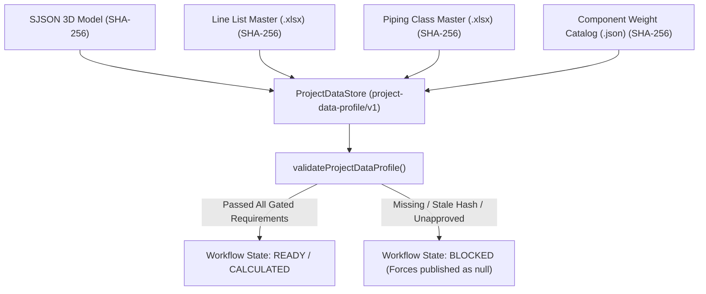
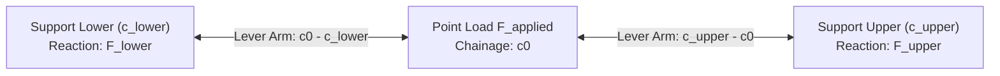

# Project Data & Pre-Flight Architecture Concept Note

**Document Revision:** 1.0  
**Scope:** Architecture overview, pedagogical guide for onboarding autonomous agents, and rigorous mathematical derivation of empirical structural reactions and load calculations.

---

## 1. Executive Summary & Core Philosophy

The engineering computation engine within this workspace (supporting **Linear FEA [LFEA]**, **Advanced Shell FEA [LAFEA]**, and empirical support load distribution) is governed by a strict architectural doctrine:

> [!CAUTION]
> **The "Zero Silent Inference" Doctrine**
> In standard software design, missing inputs are frequently handled via implicit fallbacks or silent defaults (e.g., interpolating missing gravity as \(9.81\text{ m/s}^2\), assuming carbon steel density as \(7,850\text{ kg/m}^3\), or tolerating slightly disconnected nodes). In this subsystem, **silent interpolation is strictly forbidden**. Every engineering constant, tolerance, material property, and operating condition must reside within an explicit, authoritative **Project Data Profile** backed by verifiable source evidence and explicit user approval.

### The Triad of Acceptance
Every parameter stored in the project database is modeled as an immutable `EvidenceValue` object consisting of three strictly required members:
1. `value`: The numerical, text, or structured JSON engineering input.
2. `evidence`: Provenance records tracing the exact origin of the data, including file path, sheet/row/cell locators, source key, and an immutable 64-character hexadecimal SHA-256 hash (`sourceHash`).
3. `approved`: A mandatory boolean flag indicating explicit engineering review and sign-off.

### Fail-Fast Workflow Blocking
If an analytical workflow (such as model normalization, editing, load distribution, or WebGL rendering) requires a Project Data field that is missing, unapproved (`approved: false`), or whose source SHA-256 hash diverges from the currently loaded master file, the system halts immediately. The calculation enters an explicit `'BLOCKED'` state, and numerical reactions or stresses are suppressed (published as `null`) to prevent downstream consumption of unverified or partial structural calculations.

---

## 2. Project Data Authority (`ProjectDataStore`)

The centralized state engine responsible for enforcing engineering readiness is the `ProjectDataStore` ([project-data-store.js](../src/workspace/project-data/project-data-store.js)). It operates as an in-memory authority that rejects automatic default substitutions and mandates explicit profile imports, edits, and audit checks.



### Categorical Field Groups
Parameters are organized into domain-specific functional groups ([project-data-fields.js](../src/workspace/project-data/project-data-fields.js)):
* `sourcesAndUnits`: Establishes the authoritative file paths and SHA-256 digests for SJSON geometries, line lists, piping-class catalogs, and weight registers. Also defines spatial base units (`lengthUnit: "mm"`), source up-axis (`sourceUpAxis: "Z"`), and rendering boundary transforms (e.g., source \(Z\)-up to Three.js \(Y\)-up).
* `topology`: Defines spatial proximity bounds for sequential sketcher operations, including port-match tolerances (\(1.0\text{ mm}\)), support-site grouping spheres (\(0.1\text{ mm}\)), and restraint family capabilities (e.g., mapping `REST` to vertical support capability while excluding `GUIDE` and `LINESTOP` from gravity reactivity unless configured).
* `editing`: Dictates interactive snap thresholds (\(25\text{ mm}\)), connection bounds (\(1.0\text{ mm}\)), and catalog dimension source precedence (`["componentWeightMaster", "sourceDTXR", "sourceGeometry"]`).
* `loadCalculation`: Contains thermodynamic constants and material registers: gravity (\(g\)), load multiplication factors (\(\gamma\)), carbon/alloy material densities (\(\rho_{\text{material}}\)), insulation densities (\(\rho_{\text{insulation}}\)), fluid density profiles by phase and line code (\(\rho_{\text{fluid}}\)), equilibrium force/moment tolerances, and active load case identifiers (`EMPTY`, `OPE`, `HYD`).
* `webglNavigation` & `benchmark`: Enforces visualization tolerances, picking radii, zoom rates, camera frustum margins, and regression acceptance criteria (max WebGL ready time, selection p95 latency, target frames per second).

### Validation and Auditing Mechanics
Before an analysis executes, it calls `validateProjectDataProfile(profile, workflow, activeHashes)` ([project-data-contract.js](../src/workspace/project-data/project-data-contract.js#L40-L51)). This evaluator produces an array of blocker codes if any condition is violated:
* `INVALID_NUMBER` / `NON_POSITIVE_VALUE`: Prevented by strict type checking; physical masses, densities, and tolerances must be finite positive real numbers.
* `MISSING_EVIDENCE` / `NOT_APPROVED`: Raised when an operator enters a numerical value without source justification or without toggling the formal approval sign-off check.
* `STALE_SOURCE_HASH` / `ACTIVE_SOURCE_HASH_MISSING`: Raised when the SHA-256 digest of an imported master spreadsheet or SJSON file does not match the exact hash recorded when the Project Data profile was previously validated.

---

## 3. Pre-Flight Screening & UI Mechanics

When 3D piping geometries are converted from CAD, XML, or SJSON archives, they often lack thermodynamic process metadata (operating temperatures, fluid pressures, phase states) and may contain geometrical anomalies such as duplicated or coincident support nodes. The **Pre-Flight UI** ([lfea-preflight-ui.js](../src/workspace/lfea-preflight-ui.js)) bridges raw 3D spatial geometry with analytical readiness.

### 4-Tier Topology Clustering
To prevent engineering fatigue when reviewing industrial models containing thousands of individual branch elements, the pre-flight engine flattens and groups structural items into a rigid 4-tier tree:

```
[Service Level]           (e.g., "S" for Steam, "P" for Process)
  └── [Rating Level]      (e.g., "Class 150", "Class 900")
        └── [Piping Class](e.g., "91261M7", "93001M7")
              └── [Line Key]    (e.g., "S8811951" — Isolated structural loop)
                    ├── Member Leaf 1 (Pipe Branch /B1, Bore 150mm)
                    ├── Member Leaf 2 (Valve /B2, DN150)
                    └── Member Leaf 3 (Flange /B3, Weld-neck)
```

### O(1) Master Data Enrichment ("Load Process Data")
When an engineer triggers **"⚡ Load Process Data"**, the UI matches every unassigned 3D piping branch against imported spreadsheet line list rows:
1. **Duplicate-preserving key buckets**: spreadsheet rows are pre-indexed into a `Map<normalizedKey, ordinal[]>` keyed by stripped, uppercase alphanumeric tokens ([buildNormalizedKeyBuckets](../src/workspace/lfea-preflight-resolution.js)). An earlier `Map<normalizedKey, Row>` let a second row carrying the same normalized key silently overwrite the first; buckets keep every ordinal so a collision becomes reportable.
2. **Resolution**: exactly one exact candidate yields `EXACT`, and that row contributes operating pressure \(P_1\), temperature triplets \(T_1, T_2, T_3\), phase and fluid density. Duplicate keys or several containment candidates yield `BLOCKED_AMBIGUOUS` with no selected row, and **no value is inherited** ([resolveLineKeyCandidates](../src/workspace/lfea-preflight-resolution.js)). Nothing is chosen by first-found order.
3. **DTXR explicit-thickness evidence**: `deriveWallThicknessFromDtxr()` reads a declared thickness from the source element attributes (`WT`, `WALL_THICKNESS`, `WALLTHK`, `THK`, `THICKNESS`). It performs **no schedule inference** — there is no `Sch 80` lookup — and returns `null` when no explicit value is declared, which the grid renders as `BLOCKED`. Members of one line key declaring disagreeing thicknesses render `BLOCKED_CONFLICT` rather than a chosen value.

### Review-only cells (fill-down not implemented)

The grid is read-only. Service/class fill-down and live inline overrides were classified
`REPLACE` in the Phase 0 inventory — they are to become impact-previewed proposals that
never overwrite stronger evidence — and that flow has not been built. No editable cell,
no `Fill Service`, no `Fill Class`, and no `Overridden` provenance badge exists today.
Cells display value, blocked state and resolution status only.

### Topology review (relocated)

Topology autofix no longer runs from the enrichment surface. It was classified
`RELOCATE` in [the Phase 0 inventory](enrichment-ui-phase0-inventory.md) and now lives
behind a read-only topology review owner
([lfea-topology-review-model.js](../src/workspace/lfea-topology-review-model.js),
[lfea-topology-review-from-prefea.js](../src/workspace/lfea-topology-review-from-prefea.js)).
Enrichment is read-only to geometry and topology: it proposes no merges and mutates no
shared model.

Historical note, because the previous description overstated what shipped: the retired
flow dispatched `viewport:render-autofix-overlays`, `viewport:fly-to`,
`viewport:clear-autofix-overlays` and `topology:rebuild-requested`, and **no listener for
any of them existed in `src/`**. The 3D arrow rendering and fly-to navigation described
here previously were never wired to a consumer. `analyzeTopologyOverlaps` itself survives
and is exercised by `scripts/run_load_calc.mjs`.

## 4. Novice Agent Onboarding Guide & Cheat Sheet

When onboarding, instructing, or collaborating with an autonomous AI agent to extend, debug, or maintain this codebase, adhere to the following educational guidelines and pedagogical rules:

### 1. The Core Mental Transition
* **Do not guess when debugging:** If an automated check or user simulation returns `status: 'BLOCKED'` or `verticalForceN: null`, **never attempt to adjust mathematical solver formulas or alter tolerance inequalities**. 
* **Verify the Gatekeeper First:** A blocked calculation almost always indicates that a required Project Data field is missing, unapproved (`approved: false`), or experiencing a source file hash mismatch (`STALE_SOURCE_HASH`). Always inspect the output of `validateProjectDataProfile()` first.

### 2. Best Practices for Adding Engineering Inputs
When introducing a new physical variable, spatial threshold, or material attribute to the system:
1. **Define in Schema:** Register the variable within the appropriate domain group inside `PROJECT_DATA_GROUPS` in [project-data-fields.js](../src/workspace/project-data/project-data-fields.js).
2. **Assign Workflow Requirements:** Add the parameter key (e.g., `loadCalculation.newProperty`) to the required array in `PROJECT_DATA_REQUIREMENTS` for every analytical workflow that depends on it.
3. **Fetch via Contract:** Always access the parameter within computational algorithms via `projectDataValue(profile, 'group.field')` or `projectDataEntry(profile, 'group.field')` ([project-data-contract.js](../src/workspace/project-data/project-data-contract.js)).
4. **Never Fallback:** Never write expressions like `projectDataValue(profile, '...') || 9.81` within solvers. Let a missing value remain `null` so the fail-fast blocker can properly abort the pipeline and notify the engineer.

### 3. Quick Reference Checklist for Code Review
Before submitting code or generating qualification reports, verify:
- [ ] No raw numerical constants (e.g., steel densities, gravity, snap distances) are hardcoded in operational logic or test suites without Project Data backing.
- [ ] Every newly created profile or modified data entry invokes `createEvidenceValue(value, evidence, approved)` with complete SHA-256 tracking.
- [ ] Any script handling 3D coordinate boundaries honors the explicit rendering translation rule: source coordinates must remain **Z-up** in calculation memory and rotate to **Y-up** strictly at the Three.js WebGL display boundary.
- [ ] Pre-flight UI enhancements maintain O(1) Map lookups for spreadsheet line lists to prevent browser freezing on large piping assemblies.

---

## 5. Appendix: Derivation of Vertical Gravity Support Reactions (\(F_{\text{vertical}}\)) & Structural Loads

This appendix details the rigorous mathematical procedures and engineering mechanics utilized within the empirical load calculation engine (`CHAINAGE_TRIBUTARY_SPAN_V2`, schema `support-load-distribution/v3`) implemented in [support-load-distribution-v3.js](../src/workspace/engineering-loads/support-load-distribution-v3.js), as well as structural structural loads in Linear and Advanced FEA models.

### A1. Global Coordinate Basis and Sign Conventions
* **Spatial Axis Basis:** All calculations operate directly in source geometry coordinates where **\(Z\)-up** is aligned with opposite gravity (\(+\vec{k}\)).
* **Reaction Force Convention:** A support reaction force \(F_{\text{vertical}}\) is defined as positive when acting upward along the $+Z$ axis, directly opposing gravitational acceleration (\(-\vec{k}\)). All derived reaction values are reported in Newtons (\(\text{N}\)).

### A2. Element Mass and Weight Formulation
For a designated piping route, the linear element chainage is evaluated from start (\(c_{\text{start}}\)) to end (\(c_{\text{end}}\)). For every physical topological edge or component \(i\), the total physical mass \(m_{i,\text{total}}\) is calculated in kilograms (\(\text{kg}\)) based on element type:

#### 1. Pipe Elements (`entityType === 'PIPE'`)
The total linear pipe mass is the linear sum of metallic wall mass, thermal insulation mass, and internal fluid mass:
\[
m_{i,\text{total}} = m_{\text{metal}} + m_{\text{insulation}} + m_{\text{fluid}}
\]

Given piping outside diameter \(D_o\) (\(\text{mm}\)), wall thickness \(t_w\) (\(\text{mm}\)), insulation thickness \(t_{\text{ins}}\) (\(\text{mm}\)), and element spatial length \(L_{\text{mm}}\), let length in meters be:
\[
L = \frac{L_{\text{mm}}}{1000} \quad (\text{meters})
\]
The inside pipe bore diameter \(D_i\) (\(\text{mm}\)) is derived as:
\[
D_i = D_o - 2 t_w
\]

* **Metal Mass (\(m_{\text{metal}}\)):**  
  Let \(\rho_{\text{metal}}\) (\(\text{kg/m}^3\)) be the material density retrieved from Project Data (`loadCalculation.materialDensitiesKgPerM3`). Using the circular annulus cross-sectional area conversion factor (\(10^6\text{ mm}^2/\text{m}^2\)):
  \[
  A_{\text{metal}} = \frac{\pi \left( D_o^2 - D_i^2 \right)}{4 \times 10^6} \quad (\text{m}^2)
  \]
  \[
  m_{\text{metal}} = A_{\text{metal}} \cdot L \cdot \rho_{\text{metal}}
  \]

* **Insulation Mass (\(m_{\text{insulation}}\)):**  
  Let \(\rho_{\text{ins}}\) (\(\text{kg/m}^3\)) be the insulation density retrieved from Project Data (`loadCalculation.insulationDensitiesKgPerM3`) by code:
  \[
  A_{\text{insulation}} = \frac{\pi \left( (D_o + 2 t_{\text{ins}})^2 - D_o^2 \right)}{4 \times 10^6} \quad (\text{m}^2)
  \]
  \[
  m_{\text{insulation}} = A_{\text{insulation}} \cdot L \cdot \rho_{\text{ins}}
  \]

* **Internal Fluid Mass (\(m_{\text{fluid}}\)):**  
  Fluid density \(\rho_{\text{fluid}}\) (\(\text{kg/m}^3\)) depends strictly on the active engineering load case:
  * **`EMPTY` Case:** \(\rho_{\text{fluid}} = 0 \implies m_{\text{fluid}} = 0\).
  * **`OPE` (Operating) Case:** \(\rho_{\text{fluid}}\) is extracted from `loadCalculation.operatingFluidDensitiesKgPerM3` (selecting mixed, liquid, or vapor phase density as defined in Pre-flight).
  * **`HYD` (Hydrostatic Test) Case:** \(\rho_{\text{fluid}}\) is extracted from `loadCalculation.hydroFluidDensitiesKgPerM3` (typically pressurized water, e.g., \(1,000\text{ kg/m}^3\)).
  \[
  A_{\text{bore}} = \frac{\pi D_i^2}{4 \times 10^6} \quad (\text{m}^2)
  \]
  \[
  m_{\text{fluid}} = A_{\text{bore}} \cdot L \cdot \rho_{\text{fluid}}
  \]

#### 2. Catalog In-Line Components (Valves, Flanges, Fittings)
For concentrated rigid equipment, geometric volume computation is bypassed. The system extracts the explicit catalog weight \(m_{\text{catalog}}\) (\(\text{kg}\)) directly from `loadCalculation.componentWeightsKg` matching the item's verified catalog key (e.g., `VLV3|DN150|CLASS900|REDUCED_BORE`):
\[
m_{i,\text{total}} = m_{\text{catalog}}
\]

#### 3. Gravitational Force Conversion
With total mass resolved, the gravitational force \(F_{i,\text{applied}}\) (\(\text{N}\)) acting downward along \(-Z\) is calculated using Project Data gravity \(g\) (`loadCalculation.gravityMPerS2`) and dimensionless load multiplication factor \(\gamma\) (`loadCalculation.loadFactor`):
\[
F_{i,\text{applied}} = m_{i,\text{total}} \cdot g \cdot \gamma
\]

---

### A3. Support Qualification & Spatial Route Projection
To participate in vertical gravity load sharing, a physical support site \(j\) must satisfy two criteria:
1. **Restraint Capability Qualification:** The support tag must contain an assembly member whose source type maps to vertical support capability inside Project Data (`topology.supportTypeCapabilities`). For instance, resting supports (`REST`) and fixed anchors carry vertical loads, whereas lateral axial guide clamps (`GUIDE`) or longitudinal line stops (`LINESTOP`) are systematically disqualified from gravity distribution unless explicitly authorized in Project Data.
2. **Spatial Route Projection:** The support coordinates \(\vec{p}_{\text{site}}\) are orthogonally projected onto the nearest piping topology segment line bounded by points \(\vec{p}_{\text{start}}\) and \(\vec{p}_{\text{end}}\). If the perpendicular radial projection distance \(d_{\text{proj}}\) is strictly within the approved port match tolerance (\(`topology.portMatchToleranceMm`\)):
   \[
   d_{\text{proj}} = \left\| \vec{p}_{\text{site}} - \vec{p}_{\text{seg}}(r) \right\| \le \text{Tolerance}_{\text{port}}
   \]
   Then the support is assigned an absolute linear route chainage \(c_j\) (\(\text{mm}\)) along the continuous piping branch path:
   \[
   c_j = c_{\text{start}} + r \cdot (c_{\text{end}} - c_{\text{start}})
   \]
   where \(r \in [0, 1]\) is the parametric segment fraction.

---

### A4. Tributary Span Allocation Mechanics
A valid piping route requires at least two qualified vertical supports (\(N_{\text{supp}} \ge 2\)). Loads along the route are allocated to qualified support locations via two deterministic static distribution algorithms:

#### 1. Concentrated Point Loads (`distributePoint`)
For discrete point loads (valves, flanges, fittings) acting at exact chainage \(c_0\), the algorithm searches for bracketing vertical support chainages: the lower bounding support at chainage \(c_{\text{lower}} \le c_0\) and the upper bounding support at chainage \(c_{\text{upper}} > c_0\).
* **Exact Coincidence:** If \(c_0 = c_j\) for some support \(j\), \(100\%\) of the vertical load is assigned directly to support \(j\).
* **Interior Span Allocation:** If \(c_{\text{lower}} < c_0 < c_{\text{upper}}\), the force is split inversely proportional to lever arm distance (simply supported static beam distribution):
  \[
  F_{\text{lower}} = F_{\text{applied}} \left( \frac{c_{\text{upper}} - c_0}{c_{\text{upper}} - c_{\text{lower}}} \right)
  \]
  \[
  F_{\text{upper}} = F_{\text{applied}} \left( \frac{c_0 - c_{\text{lower}}}{c_{\text{upper}} - c_{\text{lower}}} \right)
  \]
* **Unbracketed Overhangs:** If no lower or upper bracketing support exists (\(c_0 < c_{\text{min}}\) or \(c_0 > c_{\text{max}}\)), the allocation aborts, and an explicit `UNBRACKETED_ROUTE_LOAD` exclusion is raised.



#### 2. Distributed Uniform Pipe Loads (`distributeUniform`)
For a continuous pipe element stretching between chainages \([c_{\text{pipe,start}}, c_{\text{pipe,end}}]\):
1. The span is partitioned by inserting cut points at all interior support chainages that fall inside the pipe run:
   \[
   \{ c_{\text{cuts}} \} = \{ c_{\text{pipe,start}} \} \cup \{ c_k \mid c_{\text{pipe,start}} < c_k < c_{\text{pipe,end}} \} \cup \{ c_{\text{pipe,end}} \}
   \]
2. For each resulting sub-segment \(m\) spanning from \(c_m\) to \(c_{m+1}\), its proportional weight piece is computed:
   \[
   F_{\text{piece}, m} = F_{\text{applied}} \left( \frac{c_{m+1} - c_m}{c_{\text{pipe,end}} - c_{\text{pipe,start}}} \right)
   \]
3. Each \(F_{\text{piece}, m}\) is treated as a point load centered at its sub-span midpoint \(\bar{c}_m = \frac{c_m + c_{m+1}}{2}\), and is distributed to bracketing supports using `distributePoint`.

---

### A5. Superposition, Ledgers, and Global Equilibrium Verification
All individual force allocations across all routes are recorded in an audit ledger. The total empirical reaction force \(F_{\text{vertical}, j}\) at support site \(j\) is determined via linear superposition of all contributing element allocations:
\[
F_{\text{vertical}, j} = \sum_{k} \Delta F_{\text{alloc}, k \to j} \quad (\text{N})
\]

To guarantee physical statics validity, the solver evaluates **Global Equilibrium** ([support-load-distribution-v3.js](../src/workspace/engineering-loads/support-load-distribution-v3.js)) across the entire system model:
1. **Vertical Force Balance:** The absolute mismatch between total applied gravitational load and total reaction support force must remain below Project Data threshold `loadCalculation.equilibriumTolerances.forceN`:
   \[
   R_{\text{force}} = \sum_{j} F_{\text{vertical}, j} - \sum_{i} F_{i,\text{applied}}
   \]
   \[
   \left| R_{\text{force}} \right| \le \text{Tolerance}_{\text{force}}
   \]
2. **Bending Moment Balance:** Taking moments about origin zero chainage (\(c=0\)), the net rotational residual must remain below `loadCalculation.equilibriumTolerances.momentNmm`:
   \[
   R_{\text{moment}} = \sum_{j} \left( F_{\text{vertical}, j} \cdot c_j \right) - \sum_{i} \left( F_{i,\text{applied}} \cdot c_{\text{center}, i} \right)
   \]
   \[
   \left| R_{\text{moment}} \right| \le \text{Tolerance}_{\text{moment}}
   \]

If global static equilibrium residuals exceed authorized project tolerances, the check fires an `EQUILIBRIUM_CHECK_FAILED` code. All support reactions revert to `null`, preventing publication of unbalanced reactive engineering loads.

---

### A6. Extension to LFEA & LAFEA Structural FEA Load Formulation
While empirical tributary calculations provide rapid screening reactions, rigorous **Linear FEA (LFEA)** and **Advanced Shell FEA (LAFEA)** replace tributary estimation with exact matrix structural elastomechanics:
* **Global Stiffness Formulation:** Piping frame elements and 4-node/8-node shell structural elements assemble a global stiffness matrix \(\mathbf{K}\).
* **Load Case Vector (\(\mathbf{f}\)):**
  * **Gravity / Body Forces:** Integrated across element interpolation shape functions \(N_i(x,y,z)\) as distributed body loads \(\mathbf{f}_{\text{body}} = \int_\Omega \mathbf{N}^T \rho \mathbf{g} \, d\Omega\).
  * **Internal Pressure (\(P_1\)):** Applied to shell elements as normal pressure traction loads \(\mathbf{f}_{\text{press}} = \int_{\Gamma} P_1 \mathbf{N}^T \hat{n} \, d\Gamma\), producing transverse burst membrane stresses and longitudinal elongation forces.
  * **Thermal Expansion (\(T_1, T_2, T_3\)):** Computed as equivalent thermal strain load vectors \(\boldsymbol{\varepsilon}_{\text{th}} = \alpha \cdot (T_{\text{operating}} - T_{\text{ambient}}) \mathbf{I}\), producing anchor thrust loads when constrained.
  * **Imposed Displacements:** Specified boundary terminal deflection conditions applied directly via modified constraint penalty matrices or partition reduction.
* **Matrix Solution & Recovery:** Reactions and nodal displacements \(\mathbf{u}\) are resolved via deterministic LDL^T sparse factorizations (\(\mathbf{K} \mathbf{u} = \mathbf{f}\)). Member stresses, strain energy densities, and true anchor reactive moments/forces are subsequently recovered from solved nodal deformations without reliance on simplified span approximations.
